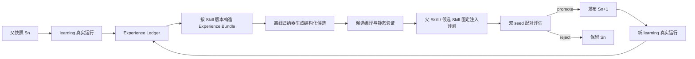

# harness3D 系统架构与实现规格 v10（评审草案）

> 版本：10.0-draft｜日期：2026-09-28｜性质：目标架构 + 当前仓库实施修订规格
> 代码基线：
>
> `main@aa5810f2177dcc5b190a3fb66cf3b9bfca4932c5`
> 上一版：《系统架构 v9.md》
> 核心目标：先以一个题型完成两代真实 Skill 演化，证明 Skill 能够从真实执行经验中积累、产生新版本、参与后续检索并再次形成新经验。

## 0. 文档定位

v10 保留 v9 中仍有效的在线求解、证据、工具授权、输入、重建、答案、数据隔离和追踪合同；本版重点修订 Skill 演化主链。

本版不再把 “存在归纳器、候选、准入函数和快照写入函数” 视为演化完成。只有完整证据链成立，才能声明发生了一轮 Skill 演化：


```
父快照真实运行

→ 形成与具体 Skill 版本绑定的合格经验

→ 生成该 Skill 的合法新版本

→ 父 Skill 与候选 Skill 分别固定注入，进行配对效果评测

→ promote 或 reject

→ 若 promote，新 episode 加载新快照并产生新经验
```

本版首期范围已经确定：


1. 只选择一个规范题型打通两代闭环；

2. 新旧 Skill 版本可以共同存在于 active 快照并竞争；

3. 首期只使用 learning/induction 与 inner\_validation，不运行 outer\_holdout；

4. 首期只证明工程闭环和 inner 开发收益，不声明独立泛化收益。

首个题型暂定为 `object_counting`。理由是答案合同简单、无需度量尺度、当前 S0 已有明确方法、容易观察检测 / 去重 / 视觉回退行为。该题型是本草案唯一待用户最终确认的范围项；替换题型不改变演化合同。


***

## 1. 当前实现结论

### 1.1 已确认事实

当前仓库的 active 指针仍为：


```
{"snapshot\_id": "S0-seed-20260925-v1"}
```

仓库仅包含八条 `1.0.0` 初始 Skill、S0 快照和静态导入收据；没有提交真实候选记录、S1/S2 快照、两代演化收据或晋升后重新运行证据。

因此，当前系统状态应描述为：


```
S0 已静态导入；在线检索与方法交付机制已实现；

真实 Skill 积累、版本修订、代际晋升和后续复用尚未完成。
```

不得描述为 “Skill 自演化已跑通”。

### 1.2 当前实现的七个阻断点


| ID    | 当前行为                             | 为什么不能形成 Skill 积累                    | v10 修订                                      |
| ----- | -------------------------------- | ----------------------------------- | ------------------------------------------- |
| EV-01 | 归纳器聚合全部 episode 的失败类别和题型         | 没有绑定到已检索、已交付、实际使用的父 Skill           | 建立 `ExperienceBundle`，按具体 Skill 版本分桶        |
| EV-02 | 新候选默认 `parent_version=None`      | 实质是从零生成模板，不是修订 S0                   | 修订必须声明父快照和父 Skill 版本                        |
| EV-03 | A 臂 `skills=[]`，B 臂强制注入单候选       | 比较的是无 Skill 与候选，不能测得候选相对父 Skill 的增益 | 效果评测中 A 固定注入父 Skill、B 固定注入候选 Skill；检索验证另行执行 |
| EV-04 | 修订时把 `# PATCH` 文本追加到 JSON 后      | 新内容不是合法 JSON，无法成为下一轮 `SkillSpec`    | patch 必须结构化应用，输出完整可校验 SkillSpec             |
| EV-05 | promote 只按 revision\_id 追加 entry | 版本谱系、竞争状态、generation 和 manifest 不完整 | 发布完整候选快照，显式登记谱系与竞争集合                        |
| EV-06 | 两轮和双 seed 仅存在配置值                 | 没有 orchestrator 消费配置并完成两代运行         | 新增 `EvolutionCampaign` 作为唯一代际调度器            |
| EV-07 | 候选评测面板可包含多个题型                    | 混合题型分数不能反映该 Skill 的效果，且可能向模型注入不适用方法 | 候选继承父 Skill 的唯一规范题型；只从独立 inner 子集中加载同题型题目   |

### 1.3 不属于本版核心问题的事项

以下模块即使继续完善，也不能代替 Skill 演化闭环：


* 增加更多工具；

* 优化 VGGT、SAM2 或 MoGe-2；

* 扩大测试数量；

* 增加向量数据库；

* 增加候选搜索分支；

* 仅跑 mock/synthetic 状态机；

* 仅创建 candidate 文件但未进入后续真实运行。


***

## 2. v10 研究问题与成功标准

### 2.1 核心研究问题

固定在线模型、输入、工具体系、检索规则、求解轮数和评分器后，是否能够从一个已交付 Skill 的真实执行经验出发，形成其可复用的新版本，并使新版本在后续未用于归纳的 inner 题目中通过正常检索参与求解？

### 2.2 首期必须回答的三个问题


1. \*\* 积累是否发生：\*\* 真实 episode 是否被正确绑定到具体 Skill 版本并形成可复用经验？

2. \*\* 迭代是否发生：\*\* 父 Skill 是否产生合法的新版本，而不是生成无父版本的独立模板？

3. \*\* 复用是否发生：\*\* 晋升后的版本是否被新 episode 正常检索、真实交付并形成第二代经验？

### 2.3 完成与收益分开


| 层级   | 判定条件                        | 可声明内容           |
| ---- | --------------------------- | --------------- |
| 机制存在 | 模块、Schema、CLI 和单测存在         | 只能声明实现了机制       |
| 单轮闭环 | S0 经验→候选→inner 决定→S1 后续真实加载 | 第一轮工程闭环完成       |
| 两代闭环 | S1 新经验→候选→inner 决定→S2 或明确拒绝 | Skill 可持续积累机制完成 |
| 开发收益 | inner 上父 / 候选配对结果满足预注册规则    | inner 开发改进      |
| 独立泛化 | 冻结后在未用于选择的 outer/final 上验证  | 首期不做、不得声明       |

即使没有候选晋升，只要真实运行、候选形成、验证和拒绝证据完整，工程链可以判定 “已运行”；但若没有新版本被后续真实 episode 加载，则不能宣称 “已完成两代 Skill 积累”。


***

## 3. v10 总体架构




说明：本文中的 Mermaid 只用于 Markdown 阅读；生产证据以 JSON/JSONL 收据为准。

系统划分为五层：


1. **在线执行层**：加载 episode 开始时冻结的快照，完成检索、交付、程序执行和答案记录；

2. **经验资格层**：从真实 trace 中建立 Skill—episode 归因和可学习材料；

3. **候选构建层**：基于父 Skill 生成结构化新版本；

4. **验证与发布层**：固定注入父 Skill 与候选 Skill，隔离检索变量后做配对效果评测；发布后另验正常检索；

5. **代际调度层**：保证第一轮发布后的新经验才能进入第二轮。


***

## 4. 保留的在线运行合同

以下 v9 合同继续有效：


* 可读图像下必须作答；重建失败只关闭相关工具，不关闭视觉路径；

* FrameSet 先冻结，少帧 / 部分缺帧不静默退出评估分母；

* 重建与尺度在首轮 Skill 检索前执行或明确失败；

* `QuestionState` 是题级证据、绑定、依赖和失效的唯一状态源；

* 工具文档展示和执行授权共用确定性判定；

* `inspect_frames`/`detect_objects` 的真实结果必须进入下一次模型请求才算 observed；

* `ReturnAnswer` 和 `YieldObservations` 是不可被程序吞掉的控制接口；

* 每个 episode 冻结一个 snapshot，不在 episode 中切换；

* 标签、GT 3D 框、GT 位姿和 GT 尺度不进入在线模型、工具和沙箱；

* 在线模型、检测器、重建、尺度、工具、阈值或评分器变化必须单独版本化，不能归因给 Skill。

v10 不重新设计上述模块，除非它们阻断单题型两代闭环。


***

## 5. Skill、版本和谱系模型

### 5.1 三个身份必须分开


```
skill\_id       稳定方法谱系，例如 S01

skill\_version  谱系内语义版本，例如 1.0.0、1.1.0、1.2.0

revision\_id    某次候选生成/修订尝试的不可变记录 ID
```

`revision_id` 不能替代 `skill_id@skill_version` 成为在线检索键。

### 5.2 新版本必须有父版本

修订已有方法时：


```
{

&#x20; "operation": "revise",

&#x20; "skill\_id": "S01",

&#x20; "parent\_skill\_version": "S01@1.0.0",

&#x20; "candidate\_skill\_version": "S01@1.1.0"

}
```

首期禁止从零创建无父版本新方法。`operation=create` 延后到单题型两代闭环完成以后。

### 5.3 新旧版本共同竞争

用户已确认：新版本晋升后，旧版本不立即退出 active；二者在同一题型分区内竞争。

但必须满足：


1. 一个 episode 对同一 `skill_id` 最多交付一个版本；

2. 检索先按题型过滤，再按谱系分组，最后在谱系内选版本；

3. `top_k` 针对方法谱系，而不是任意版本条目；

4. 同一谱系默认最多保留两个在线竞争版本；

5. 第三个版本晋升时，最旧版本转为 `historical`，仍保留在历史快照但不参加新 episode；

6. 不允许通过版本号大小直接获得排序加分；

7. 检索分数、稳定 tie-break 和版本选择原因必须落盘。

首期的竞争集合：


```
第一代发布后：S01@1.0.0 + S01@1.1.0

第二代发布后：S01@1.1.0 + S01@1.2.0

S01@1.0.0 转 historical
```

若第一代候选被拒绝，则第二轮仍从 S01@1.0.0 的新真实经验出发，但不能伪称 S1 已存在。

### 5.4 SkillSpec 是完整值对象

候选修订必须产生完整合法 `SkillSpec`，禁止把自由文本直接拼接到序列化 JSON 后。

允许两种实现：


* JSON Merge Patch / JSON Patch 作用于解析后的对象，再完整序列化；

* 离线模型直接输出完整候选 `SkillSpec`，框架做父 / 子字段差分。

首期推荐第二种：离线模型输出完整候选，框架负责验证和生成 diff。

静态检查至少包括：


* JSON 可解析；

* Pydantic `extra=forbid` 通过；

* `skill_id` 与父版本一致；

* `version` 合法递增；

* 只属于一个规范题型；

* 方法正文可完整交付；

* 工具名来自当前 ToolSpec；

* 无题号、场景 ID、答案或标签泄漏；

* 父版本 hash 与候选记录一致；

* diff 非空且与候选完整内容一致。


***

## 6. 经验账本与学习资格

### 6.1 ExperienceEvent

每个 episode 对每条候选 Skill 产生一个经验事件：


```
class ExperienceEvent(Spec):

&#x20;   experience\_id: str

&#x20;   campaign\_id: str

&#x20;   generation: int

&#x20;   episode\_id: str

&#x20;   scene\_id: str

&#x20;   split: Literal\["learning", "inner\_validation"]

&#x20;   snapshot\_id: str

&#x20;   skill\_id: str

&#x20;   skill\_version: str

&#x20;   retrieval\_state: Literal\[

&#x20;       "not\_retrieved", "retrieved\_not\_delivered",

&#x20;       "delivered\_not\_used", "usage\_supported"

&#x20;   ]

&#x20;   retrieval\_record\_ref: str

&#x20;   delivery\_content\_sha256: str | None

&#x20;   usage\_clue\_refs: list\[str]

&#x20;   outcome\_ref: str

&#x20;   failure\_categories: list\[str]

&#x20;   answer\_correct: bool | None

&#x20;   label\_access: bool

&#x20;   eligible\_for\_induction: bool

&#x20;   exclusion\_reasons: list\[str]
```

### 6.2 主要修订经验

只有同时满足以下条件的 learning episode，才能作为某个 Skill 的主要修订经验：


1. episode 使用父快照运行；

2. Skill 被正常检索；

3. Skill 正文真正进入模型请求；

4. 至少存在可观察的程序使用线索；

5. trace、结果和版本身份完整；

6. 不属于 inner/final；

7. 没有 Schema 损坏、缺失映射或无法确认快照身份。

`delivered_not_used` 只能用于改进描述和检索适用性；`not_retrieved` 只能用于识别覆盖缺口，不能冒充该 Skill 的执行经验。

### 6.3 ExperienceBundle

归纳器不直接读取一个目录中的所有 trace，而是读取框架生成的不可变经验包：


```
class ExperienceBundle(Spec):

&#x20;   bundle\_id: str

&#x20;   campaign\_id: str

&#x20;   generation: int

&#x20;   parent\_snapshot\_id: str

&#x20;   parent\_skill\_id: str

&#x20;   parent\_skill\_version: str

&#x20;   canonical\_question\_type: str

&#x20;   eligible\_experience\_refs: list\[str]

&#x20;   excluded\_experience\_refs: list\[str]

&#x20;   exclusion\_summary: dict\[str, int]

&#x20;   scene\_count: int

&#x20;   success\_count: int

&#x20;   failure\_count: int

&#x20;   behavior\_summary: dict

&#x20;   failure\_summary: dict

&#x20;   source\_manifest\_hash: str
```

经验包必须按 `skill_id@version` 构建，禁止把多个题型或多个父 Skill 的经验混入同一个修订请求。

### 6.4 标签边界


* learning 的答对 / 答错和误差可由离线归纳器使用，但必须记录 `label_access=true`；

* 可把错误类型、答案偏差区间、工具 / 视觉冲突类型提供给归纳器；

* 不把具体标准答案、sample ID、GT 3D 标注写入候选内容；

* inner 的逐题内容和反馈不进入下一次候选修订；首期 inner 只作选择门。


***

## 7. 候选生成合同

### 7.1 输入

离线归纳器每次只收到：


* 父 Skill 完整 `SkillSpec`；

* 父版本的 ExperienceBundle；

* 允许使用的失败摘要和行为摘要；

* 当前 ToolSpec 摘要；

* 候选输出 Schema；

* 禁止泄漏和禁止修改项。

### 7.2 输出


```
class SkillCandidate(Spec):

&#x20;   candidate\_id: str

&#x20;   campaign\_id: str

&#x20;   generation: int

&#x20;   operation: Literal\["revise"]

&#x20;   parent\_snapshot\_id: str

&#x20;   parent\_skill\_version: str

&#x20;   candidate\_skill\_version: str

&#x20;   canonical\_question\_type: str

&#x20;   hypothesis: str

&#x20;   expected\_effect: str

&#x20;   known\_risks: list\[str]

&#x20;   full\_skill\_spec: SkillSpec

&#x20;   structured\_diff: list\[dict]

&#x20;   source\_experience\_bundle\_ref: str

&#x20;   inducer\_receipt\_ref: str
```

### 7.3 版本递增

首期规则：


* 修改描述、步骤、检查、示例或失败教训：MINOR bump；

* 只修错字且不改变行为：PATCH bump，但此类候选不进入性能演化；

* 修改题型、硬证据条件或权限语义：MAJOR bump，并视为超出首期范围。

### 7.4 失败处理


* 输出不是合法 JSON：最多按同一操作规则重试；

* Schema 不合法：生成结构化错误反馈，产生新 revision；

* 超过最大 revision 数：reject；

* 离线模型不可用：quarantine，不创建伪候选；

* 候选与父版本无行为差异：reject，原因 `no_effective_diff`。


***

## 8. Skill 效果评测与检索验证分离

### 8.1 两种验证回答不同问题

v10 把候选验证拆成两条独立通道：


| 通道   | 要回答的问题               | Skill 输入方式          | 是否参与准入      |
| ---- | -------------------- | ------------------- | ----------- |
| 效果评测 | 候选 Skill 是否优于父 Skill | A/B 各固定注入一条完整 Skill | 是           |
| 检索验证 | 发布后的新版本能否被正常发现、选择和交付 | 加载 active 快照，运行正常检索 | 否，作为发布后闭环验收 |

不能在同一个实验中同时改变 Skill 内容和检索选择，否则无法判断差异来自 Skill 本身还是检索器。

### 8.2 效果评测 A/B 定义

评测目标 Skill 时跳过检索选择，但不跳过 Skill 的适用性、内容长度、工具权限和 Schema 校验：


| 臂 | 模型上下文中的 Skill               | 其他条件     |
| - | --------------------------- | -------- |
| A | 固定注入父 Skill，例如 `S01@1.0.0`  | 与 B 完全一致 |
| B | 固定注入候选 Skill，例如 `S01@1.1.0` | 与 A 完全一致 |

每次模型请求只包含该臂被评测的一条完整 Skill。除该 Skill 的版本和正文外，A/B 的题目、FrameSet、基础 artifact、工具、权限、模型、提示词公共部分、求解轮数、重试规则和 seed 必须一致。

评测注入必须显式标记：


```
class SkillEvaluationBinding(Spec):

&#x20;   mode: Literal\["fixed\_skill\_evaluation"]

&#x20;   arm: Literal\["parent", "candidate"]

&#x20;   skill\_id: str

&#x20;   skill\_version: str

&#x20;   content\_sha256: str

&#x20;   bypassed\_component: Literal\["retrieval\_selection"]
```

该模式只能用于候选效果评测，不能用于 learning 经验采集、发布后运行或最终系统成绩。

### 8.3 效果评测禁止事项

禁止：


* A 使用空 Skill、B 使用候选 Skill；

* A/B 同时向模型提供父、候选或其他 Skill；

* 让模型在评测阶段选择被评测 Skill；

* 将固定注入记录成正常检索命中；

* 因候选失败而更改题目、工具、阈值、prompt 公共部分或 seed；

* 用固定注入结果证明检索器能够找到候选。

### 8.4 发布后的正常检索

候选通过效果评测并发布后，新的 learning episode 加载完整 active 快照，走正常检索。此时允许新旧版本共同存在和竞争，但同一 episode 对同一 `skill_id` 最多交付一个版本。

正常运行采用两阶段选择：


1. 检索器按题型和硬条件产生最多三条候选摘要；

2. 在线模型只根据候选摘要选择一条 `selected_skill_version`；

3. 框架重建后续上下文，只放入被选版本的完整正文；

4. 未选版本不进入后续模型上下文。

选择阶段与执行阶段分别记录请求 hash；只有第二阶段实际发送的完整正文才记 `delivered`。候选新版本没有被选中是有效的检索结果，不影响已经完成的效果准入，但不能形成该版本的新学习经验。

### 8.5 评测题型与面板来源

候选的测试题型由父 Skill 唯一确定，不由模型选择，也不根据候选表现临时决定：


```
candidate.canonical\_question\_type

\= parent\_skill.applicable\_question\_types\[0]

\= experience\_bundle.canonical\_question\_type
```

三处必须完全一致，否则候选静态检查失败。

测试题来自预先冻结、未参与候选生成的独立同题型 inner 子集：


```
test\_items = \[

&#x20;   item for item in frozen\_inner\_generation\_panel

&#x20;   if canonical\_task(item.question\_type)

&#x20;      \== candidate.canonical\_question\_type

]
```

因此，产生候选与测试候选遵循 “同题型、不同题目、场景隔离优先” 的规则：


* learning 中该题型的题目用于形成 ExperienceBundle；

* inner 中未参与候选生成的同题型题目用于固定注入 A/B；

* 父 Skill 和候选 Skill 必须运行完全相同的测试题清单；

* 其他题型不得进入该候选的效果分数；

* 方向题的 easy/medium/hard 保留为同一 `object_rel_direction` 题型下的分层；

* 面板清单、scene、qa\_id、seed 和 hash 在查看候选结果前冻结。

首期使用：


* `learning_g0`：通过正常检索产生 S0 经验；

* `inner_g0`：从独立同题型子集固定注入父 / 候选 Skill，验证 S0→S1；

* `learning_g1`：S1 发布后通过正常检索运行，产生第二代新经验；

* `inner_g1`：从另一独立同题型子集固定注入父 / 候选 Skill，验证 S1→S2。

`learning_g0` 与 `learning_g1` 可以来自同一 learning 场景池，但必须是两次独立真实运行，并记录不同 generation、snapshot 和 run ID。第二轮不能复用第一轮旧 trace 冒充新经验。

inner 不得向归纳器暴露逐题内容。为了避免反复在同一 inner 结果上过拟合，首期每一代使用预先固定且互不重叠的 `inner_g0`、`inner_g1` 子面板；若样本不足，则降低结论等级并停止第二代，而不是复用同一逐题反馈反复修订。

### 8.6 双 seed

每个候选分别在 seed 0、1 上运行固定注入 A/B；两个 seed 均必须满足：


1. 同题型完整 inner 子面板得分严格提高；

2. `run_error` 不增加；

3. 合法答案率不下降；

4. 无 Schema、数据权限和工具权限违规；

5. A/B 对应的完整 Skill 正文均真实进入模型请求。

首期不要求置信区间下界大于 0，也不使用 outer。小面板双 seed 改善只表示开发门通过，不表示统计显著。


***

## 9. 新旧版本竞争与经验归因

### 9.1 为什么保留旧版本

保留旧版本可用于：


* 让不同证据状态选择不同方法；

* 观察新版本是否只在部分问题上更合适；

* 防止一次晋升永久覆盖仍有价值的旧策略；

* 为第二代积累比较性经验。

### 9.2 竞争不能破坏因果归因

每题只能交付同谱系一个版本。若允许同时交付 S01@1.0.0 和 S01@1.1.0，则最终答案无法可靠归属到其中一条，相关 episode 不得进入主要修订经验。

### 9.3 生命周期


```
candidate → challenger → active\_competing → historical

&#x20;                        ↘ quarantined
```


* `candidate`：文件已生成，未进入验证快照；

* `challenger`：仅候选快照可见；

* `active_competing`：晋升后进入 active，与上一版本竞争；

* `historical`：保留审计，不参与新检索；

* `quarantined`：违反静态、安全或数据规则。

### 9.4 竞争统计

每代至少报告：


* 每个版本 eligible 次数；

* retrieved 次数；

* delivered 次数；

* usage-supported 次数；

* 正确率 / MRA；

* 运行错误数；

* 各证据状态下的选择分布；

* 新版本新增、失去和共同命中范围。

调用率不作为优化目标，但必须用于解释新版本是否真正参与运行。


***

## 10. 发布语义

### 10.1 原子发布完整快照

promotion 不再直接向当前 JSON 的 `entries[revision_id]` 追加。发布过程为：


1. 读取并锁定父快照；

2. 根据候选 operation 构建完整候选快照；

3. 重算 entries、竞争集合、`skill_versions`、generation、manifest hash；

4. 校验所有 SkillSpec 和谱系关系；

5. 写入不可变 snapshot 文件；

6. 原子切换 active pointer；

7. 新 episode 才读取新 active；

8. 保存父快照以供回滚。

### 10.2 发布后验证

promotion 成功不等于新 Skill 已复用。必须至少运行一个新的 learning episode，并证明：


* episode 加载的是新 snapshot ID；

* 检索候选包含新版本；

* 新版本在至少一个 episode 中被 retrieved 和 delivered；

* 请求中的正文 hash 与 snapshot 内容一致；

* 新经验事件指向新版本。

不满足以上条件时，状态只能是 `promoted_not_observed`，不能开始下一代归纳。


***

## 11. EvolutionCampaign：两代唯一调度入口

### 11.1 状态机


```
INIT

→ RUN\_PARENT\_LEARNING

→ BUILD\_EXPERIENCE\_BUNDLE

→ GENERATE\_CANDIDATE

→ STATIC\_VALIDATE

→ BUILD\_CANDIDATE\_SNAPSHOT

→ RUN\_INNER\_SEED\_0

→ RUN\_INNER\_SEED\_1

→ DECIDE

→ PUBLISH\_OR\_REJECT

→ VERIFY\_POST\_PUBLISH\_USE

→ NEXT\_GENERATION

→ COMPLETE
```

任何状态失败都写 checkpoint；恢复时不得重复消费已经完成的模型调用、面板或发布动作。

### 11.2 Campaign Schema


```
class EvolutionCampaign(Spec):

&#x20;   campaign\_id: str

&#x20;   target\_question\_type: str

&#x20;   target\_skill\_id: str

&#x20;   max\_generations: int

&#x20;   current\_generation: int

&#x20;   initial\_snapshot\_id: str

&#x20;   current\_parent\_snapshot\_id: str

&#x20;   state: str

&#x20;   generation\_receipt\_refs: list\[str]

&#x20;   final\_snapshot\_id: str | None

&#x20;   completion\_status: Literal\[

&#x20;       "running", "completed\_two\_generations",

&#x20;       "completed\_with\_rejection", "blocked", "failed"

&#x20;   ]
```

### 11.3 两代定义

第一代：


```
S0 learning 真实运行 → S01@1.1.0 候选 → inner\_g0 双 seed → 决定
```

第二代必须从随后产生的新经验开始：


* 若 S01@1.1.0 晋升且被真实使用：以其经验修订为 S01@1.2.0；

* 若第一代拒绝：以 S01@1.0.0 的新一批真实经验提出另一个 1.1.0 候选，并明确记 `generation=2, parent_snapshot=S0`；

* 不能将第一代同一批 trace 再提交一次；

* 不能把第一代候选内部的多次 revision 算作第二代。


***

## 12. 首期单题型方案

### 12.1 暂定题型


```
target\_question\_type = object\_counting

target\_skill\_id = S01

initial\_skill\_version = 1.0.0
```

### 12.2 首期允许修改


* 目标类别识别步骤；

* 跨帧覆盖策略；

* 重复实例与遮挡重现处理；

* 检测故障、截断和空检出的分支；

* 工具结果与视觉证据冲突时的处理；

* 提交前检查、失败教训和通用代码示例。

### 12.3 首期禁止同时修改


* 检测模型和阈值；

* SAM2 参数；

* FrameSet；

* Qwen3-VL 权重、量化和采样；

* 工具实现；

* 评分器；

* 检索权重和 top-k；

* 数据划分；

* 求解轮数和重试次数。

否则无法把结果变化归因给 Skill。


***

## 13. 准入规则

候选在两个固定 seed 上分别满足以下条件才 promote：


1. 整个对应 inner 子面板得分严格提高；

2. `run_error` 数量不增加；

3. 合法答案率不下降；

4. 候选至少真实交付一次；

5. A/B 使用同一 episode、FrameSet、基础 artifact、工具版本、模型和配置；

6. 候选内容、来源和经验资格全部通过；

7. 每题最多交付该谱系一个版本。

任一 seed 持平、下降、候选零交付或运行错误增加，则 reject。

成本只报告，不作为首期准入门。


***

## 14. Trace 与收据

### 14.1 每一代必须产出


| 产物                         | 核心内容                     |
| -------------------------- | ------------------------ |
| `parent_run_manifest.json` | 父快照、代码、模型、配置、题目清单、seed   |
| `experience_events.jsonl`  | episode—Skill 版本绑定和学习资格  |
| `experience_bundle.json`   | 父 Skill 的合格经验包           |
| `candidate.json`           | 完整候选、结构化 diff、父版本和假设     |
| `static_validation.json`   | Schema、工具、泄漏、版本、长度检查     |
| `candidate_snapshot.json`  | 父库 + challenger 的完整不可变快照 |
| `paired_seed_0.json`       | seed 0 父 / 候选逐题配对结果      |
| `paired_seed_1.json`       | seed 1 父 / 候选逐题配对结果      |
| `decision.json`            | promote/reject 及每项条件     |
| `promotion.json`           | 快照切换、父子关系和 manifest hash |
| `post_publish_use.json`    | 新快照、新版本实际检索与交付证明         |

### 14.2 完整性判定

缺少任一关键收据时，该代状态为 `incomplete`。不能从控制台日志、函数返回值或 active 指针推断缺失环节已经发生。


***

## 15. 实施修改清单

### P0：修复不可运行的演化语义


1. `governance/induce.py`

* 输入改为单个父 Skill 的 ExperienceBundle；

* 不再默认 `parent_version=None`；

* 输出完整候选 SkillSpec。

1. `governance/revise_patch.py`

* 删除字符串追加 `# PATCH`；

* 对解析后的对象应用结构化变更；

* 每次修订后立即做 Schema 与版本检查。

1. `evolution/panel.py`

* A/B 改为分别固定注入父 Skill 与候选 Skill；

* 每次请求只交付当前臂的一条完整 Skill；

* 固定注入显式标记为 `fixed_skill_evaluation`，不得伪装成检索命中；

* 禁止 `skills=[]` 对 `[candidate]` 作为主准入比较。

1. `skills/promote_atomic.py`

* 发布完整快照；

* 维护 generation、skill\_versions、manifest 和谱系竞争状态；

* 支持最多两个 active competing 版本。

### P1：建立真实经验资格


1. 从 `EpisodeTrace.retrieval_records` 和交付账本生成 ExperienceEvent；

2. 实现 `usage_supported` 的确定性规则；

3. 按 `skill_id@version` 聚合 ExperienceBundle；

4. 拒绝未交付、未使用、非 learning 或身份不完整的主要修订经验；

5. 保存排除原因统计。

### P2：实现两代调度


1. 新增 `EvolutionCampaign`；

2. 真正读取 `max_evolution_rounds`；

3. 真正读取 `candidate_validation_seeds`；

4. 第一代发布后强制执行 post-publish use 检查；

5. 第二代只能读取第一代之后产生的经验；

6. 支持第一代拒绝后的新经验重试路径，但不伪造代际版本。

### P3：真实验收


1. 冻结 `object_counting` 的 learning 与两个 inner 子面板；

2. 运行 S0 learning；

3. 完成第一代候选及双 seed 决定；

4. 晋升则运行竞争快照并形成新经验；

5. 完成第二代候选及双 seed 决定；

6. 输出两代审计报告。


***

## 16. 测试要求

### 16.1 单元测试


* 非 eligible 轨迹不能进入 ExperienceBundle；

* 不同 Skill 版本的经验不能混桶；

* 修订输出始终是合法完整 SkillSpec；

* 父 / 子版本和 hash 不一致时失败；

* 同一谱系每题最多选择一个版本；

* 第三个 active 版本进入时，最旧版本转 historical；

* generation 和 manifest 每次发布均重算；

* 同一批旧经验不能计为下一代。

### 16.2 集成测试


* inner A/B 分别固定注入父 Skill 与候选 Skill，并核对两臂正文 hash；

* 固定注入记录不得写成正常检索命中；

* promote 后新 episode 加载新 snapshot 并恢复正常检索；

* 新版本正文 hash 与真实请求一致；

* 新版本至少产生一条 eligible ExperienceEvent；

* reject 后 active pointer 不变；

* 中断恢复不重复发布或消费面板。

### 16.3 真实测试

mock 和 synthetic 只能验证结构，不能完成首期验收。真实验收至少包含：


* 真实 VSI-Bench 图片；

* 真实在线 Qwen3-VL 请求；

* 真实 S0 方法交付；

* 真实离线归纳调用；

* 真实父 / 候选 inner 双 seed；

* 真实晋升或拒绝；

* 如晋升，真实后续新 episode 对新版本的检索与交付。


***

## 17. 首期完成定义

### 17.1 最低完成条件

必须全部满足：


1. 锁定代码 commit、模型、配置和数据清单；

2. `object_counting` 的 S0 在 learning 上真实运行；

3. 至少形成一个合格 ExperienceBundle；

4. 生成 S01 的合法新版本；

5. 使用父 Skill 与候选 Skill 分别固定注入完成 inner 双 seed 效果评测；

6. 产生真实 promote 或 reject 决定；

7. 进入第二代并使用新的真实运行经验；

8. 第二代再次产生候选和决定；

9. 所有关键收据可从 campaign ID 串联；

10. 输出范围正确的结论，不把 inner 结果称为独立泛化。

### 17.2 成功场景


* 第一代与第二代都晋升：完成 S0→S1→S2；

* 第一代晋升、第二代拒绝：完成一代积累和第二代真实尝试；

* 第一代拒绝、第二轮基于新经验仍拒绝：证明闭环能运行，但未实现版本积累；

* 第一代晋升但新版本从未被后续检索：发布机制成功，积累闭环失败。

### 17.3 禁止的完成声明

以下任何一种都不能称为 “两代真实演化完成”：


* 两次修改同一个候选 revision；

* 两次使用同一批旧 trace；

* mock 离线模型生成两个版本；

* synthetic 面板两次运行；

* 候选文件存在但未通过正常检索；

* active 指针改变但新版本未进入真实模型请求；

* 只看到总体得分，没有版本级交付证据。


***

## 18. 首期报告模板


```
代码版本：

初始快照：

目标题型/Skill：

冻结配置 hash：

Generation 1

\- 父版本：

\- learning 运行与合格经验数：

\- 候选版本与 diff：

\- seed 0 父/候选得分、错误数、交付覆盖：

\- seed 1 父/候选得分、错误数、交付覆盖：

\- 决定：promote/reject

\- 发布后真实使用证据：

Generation 2

\- 父版本或父快照：

\- 新 learning 运行身份：

\- 新合格经验数：

\- 候选版本与 diff：

\- 两 seed 结果：

\- 决定：promote/reject

可声明结论：

不可声明结论：

未完成项：
```


***

## 19. 与 v9 的主要变化


| v9                  | v10                                      |
| ------------------- | ---------------------------------------- |
| 规定至少两轮真实演化，但调度语义较分散 | 用 EvolutionCampaign 定义唯一两代入口和状态机         |
| 经验按命中 / 选择 / 使用分类   | 新增可执行 ExperienceEvent 与 ExperienceBundle |
| 候选可以修订、新增、合并、停用     | 首期只允许修订一个已有 Skill                        |
| 候选同题型面板正常检索         | 效果准入固定注入父 / 候选 Skill；正常检索作为发布后独立验收       |
| 新版本发布不可变快照          | 明确新旧共同竞争、每题同谱系只交付一个版本                    |
| 至少两个固定 seed         | 明确由 campaign 实际调度并逐 seed 判定              |
| 至少两轮真实经验            | 明确第二代必须来自第一代之后的新真实运行                     |
| 计划完成八题型 E−S0        | 首期收缩为单题型两代闭环，outer 暂缓                    |


***

## 20. 当前待确认项


1. 首个题型是否正式确定为 `object_counting`；

2. 同一谱系最多两个在线竞争版本是否接受；

3. `inner_g0` 与 `inner_g1` 是否必须互不重叠；若样本不足，是否允许同一 inner 面板仅做两代工程验收但降低结论等级。

除以上三项外，本草案已按当前讨论固化：单题型、两代、新旧共同竞争、首期仅 inner。


***

## 21. 交给 coding agent 的执行要求

不要继续以 “模块已经存在” 作为演化完成证据。先按 P0→P3 修复并跑通最小闭环。

提交实现时必须同时提供：


* 改动文件与迁移说明；

* 针对七个阻断点的逐项修复证据；

* 单元和集成测试结果；

* 一次完整两代 campaign 的全部收据；

* 每代父 / 候选快照内容；

* 新版本真实进入后续模型请求的正文 hash；

* 未完成、被拒绝或无收益的真实结果。

不得用 mock、空 Skill 基线、把固定评测注入伪装成正常检索、控制台文本或 active 指针变化替代真实 Skill 积累证据。

**文档状态：评审草案。确认第 20 章待确认项后冻结为 v10.0。**