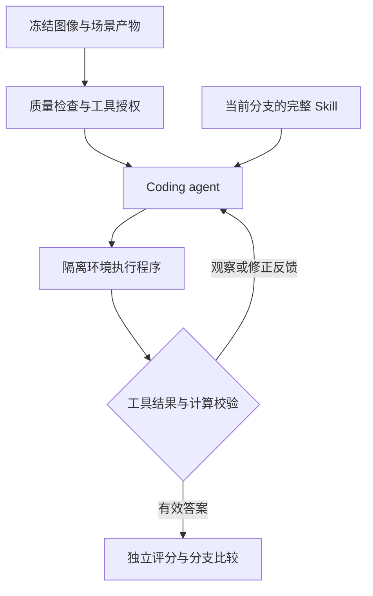

# harness3D 系统架构 v11：Skill 指导的可校验 3D 代码推理

> 版本：11.0-draft｜日期：2026-10-03｜核对基线：`main@730e88ab4e86586aacdab870f277ff85ecd4ba60`
> 性质：下一版目标规格；本文不表示代码已经完成迁移或性能已经提升。
> 本次目标：围绕 Skill 指导代码生成的受控对比组织系统，将已确认有效的几何质量校验作为固定基础条件，缩减编排与治理流程，修正 Skill 的表示与交付。

## 1. 研究目标与范围

系统围绕两项待实验验证的核心主张展开，并将工具质量校验作为两臂共同启用的已确认基础条件：

| 定位 | 系统实现 | 本版处理 |
|---|---|---|
| **待验证主张 1：类沙箱机制下的 Skill→代码对比实验** | 同一个 coding agent 在隔离执行分支中分别接受无 Skill 或冻结 Skill，生成并执行代码 | Skill 是否改善程序行为与答案？改进是否来自方法内容？ |
| **固定基础条件：对工具使用进行校验** | 检查重建质量、工具前置证据及返回结果，在程序使用前授权、使用后核验 | 几何质量校验已确认有效；本版固定开启，不再设置关闭臂或重复验证其收益 |
| **待验证主张 2：将 Skill 指导生成代码引入 3D 推理** | 将对象关联、坐标、距离、方向与尺度规则写成方法，指导代码组合感知和几何工具 | 领域方法是否改善空间计算与证据使用，而不仅是改变回答措辞？ |

这里的 coding agent 是“读取题目、图像、方法和工具接口后生成程序的在线 agent”，当前可沿用 Qwen3-VL，不隐含更换模型。Skill 演化负责提供可比较的新方法，是支撑流程；主贡献不以两代晋升次数或治理模块数量定义。

原 Skill-3D 已有场景相关方法和工具使用策略。[R3] 因此第二项待验证主张应表述为“将 Skill 指导的代码生成与执行用于可校验的 3D 推理”，不能仅以“Skill 用于 3D”宣称首次；区别应落在程序执行、固定工具校验及受控实验结果上。

保留八类 S0 方法。计数继续作为工程冒烟与既有演化回归；核心实验至少增加一个已有的几何题型切片，优先 `object_rel_distance / S03`，避免只凭计数结果声称验证了 3D 计算。先做冻结 S0 的核心对比，再按需运行单题型两轮修订；独立泛化在方案冻结后验证。

## 2. 相对 v10 的删减

下列为 v11 的设计选择，替代 v10 对应要求；不是对历史运行的重新解释。

| v10／历史机制 | v11 主线 |
|---|---|
| 每谱系两个在线版本竞争、模型单独选择版本、第三版历史化 | 每谱系一个活跃版本；发布时替换指针，旧版本只供对照与回滚 |
| top-k、向量排序、reranker、独立选择请求 | 首期按规范题型查找唯一活跃方法；没有方法就以公共求解合同运行 |
| `program_synth_v8`、早期 v11 提示词及对应执行分支并存 | 当前运行时只保留 `program_synth_v11_2`、`solver-v11.2-m11-acceptance` 与 `tool-docs-v11.1`；历史复现使用对应 Git 提交 |
| 13 个演化状态和多类独立收据 | 演化作为辅助的四阶段流程；核心先跑质量门固定开启的 Skill on/off 受控对比 |
| L1/L2/L3、反例搜索、分支优化、独立模型审查等旧治理链 | 不进入本轮主流程；直接评测一个完整候选 |
| 双 seed 作为固定准入门 | 首期一个预先冻结的请求 seed；若预登记多个，则逐一真实传入并全部通过 |
| 仅工具名交叠／自声明支持的轨迹可学习 | 已交付且身份完整的 learning 轨迹可学习；使用线索只作诊断 |
| 每个 Skill 固定 11 个章节及大段相同执行合同 | 精简方法正文；公共约束由框架统一注入；空章节删除 |
| Memory 数据库、成熟度阶梯、复杂成本门、额外平台建设 | 不作为核心实验前置条件；沿用必要缓存，成本只报告 |

这里的“删除”对运行代码是字面含义：当前 checkout 不保留历史提示词、工具文档、旧
M8–M11 编排或旧快照的在线兼容分支。历史实验结果、trace 和不可变快照可以作为只读证据
保存，但当前代码不承诺重放；需要复现实验时 checkout 对应 Git 提交。测试只保留仍约束
当前合同的部分，不因文件名带 v9/v10 就机械删除。单活跃版本取消的是线上竞争，父／候选
的离线比较仍保留。单 seed 只服务开发实验，不构成稳定性或统计显著性证明。

## 3. 最小系统结构

| 模块 | 输入与输出 | 复用位置 |
|---|---|---|
| 3D 方法库 | 题型与快照 → 一条完整 Skill | `skills/`、`routing/` |
| Coding agent 与执行环境 | 图像、方法、工具接口 → 程序、执行轨迹、答案 | `online/runner.py`、`synthesis/`、`sandbox/` |
| 工具校验层 | 场景产物、调用参数与结果 → 可用性、违规和修正反馈 | `reconstruction_gate/`、`tools/contract.py`、`verifier/` |
| 实验驱动器 | 冻结输入与分支配置 → 逐题配对结果；可选方法修订与发布 | `evaluation/skill_ablation_v11.py`、`evolution/campaign_v11.py`、`governance/` |



在线只保留一条求解循环：冻结输入与快照；执行或复用场景前置；按题型加载方法；
同一个 Qwen3-VL 看图生成程序；执行工具；必要时把观察送回下一轮。所有
`C1_tools_program` 入口固定使用公共提示词 `program_synth_v11_2`、执行协议
`solver-v11.2-m11-acceptance` 和工具文档 `tool-docs-v11.1`。三者是必须落盘的当前
合同身份，不是可由 YAML／CLI 切换求解语义的实验参数。`ReturnAnswer` 只暂存本轮提交，
M11 使用当前轮及历史未失效结果做确定性验收；通过后才独立评分，失败则撤销受影响结果、
清空暂存答案并把结构化原因反馈给同一个 Qwen3-VL。沿用当前求解轮数及有限重试配置，
不再增加选择轮、审查轮或专门的修复 agent。

下列七条属于正确性条件，不能为简化而删掉：

- 同一 episode 固定输入与快照；成对比较使用相同实际帧集、基础产物和模型配置。
- 有可读图像时继续求解；感知失败只关闭依赖该证据的工具。全部图像不可读则记输入错误，保留评估分母。
- `QuestionState` 继续管理题级绑定、证据与失效；工具文档和执行权限共用同一判定。
- 新图像／工具观察实际进入模型请求才记已观察；失效结果不能继续支持答案。
- 在线求解期间，coding agent、工具和沙箱不读标准答案或 GT 三维标注，评分器独立持有
  标签；离线 Skill 修订阶段可以按 §6 读取 `induction` 的题目级标准答案与评分，但这
  不得改变在线求解的标签隔离。
- 演化期冻结模型、工具、阈值、评分器与求解预算；系统改动另建基线。
- `SkillSpecV11`、公共提示词、工具文档和执行协议作为不可拆分的运行合同校验；任何旧格式或版本错配必须在首次模型请求前失败。

VGGT、可选 MoGe-2、按需检测／SAM2 复用现有实现。研究重点是 coding agent 如何在 Skill 指导下使用这些工具，以及框架如何校验其可靠性；不新增重建主干或训练系统。

### 3.1 类沙箱执行与核心对比

这里的沙箱首先是**可控的程序执行与分支隔离机制**。每个实验臂使用独立程序命名空间、题级状态、临时输出和结果登记；只共享只读图像与冻结基础产物，不共享另一臂的答案、程序变量、追加检测结果或运行记忆。保持相同代码能力和预算，不要求为本研究建设完整容器安全平台。

核心实验只保留 B01／B11 两臂，所有组均由同一 coding agent 生成代码并执行：

| 实验组 | 方法指导 | 几何质量门 | 比较目的 |
|---|---|---|---|
| B01 | 无 Skill | 固定开启 | 共同 coding-agent 基线 |
| B11 | 冻结 S0 Skill | 固定开启 | 主系统；B11−B01 为 Skill 对程序行为与答案的效果 |

两臂使用完全相同且固定开启的几何质量门、工具前置检查和结果合同；质量指标、授权结果与违规仍进入 trace，但不是本版实验自变量。B01／B11 的唯一方法变量是是否交付冻结 Skill，因此不得从两臂差异推断质量门收益。B00／B10 不进入主实验，也不为本版新增质量门关闭路径。

B01 和 B11 天然使用唯一的当前公共提示词、工具文档与执行协议，不再各自配置模板版本。
普通在线入口、配对入口和发布后运行必须调用同一个 solver；不得为实验入口保留一套
M11 可重入语义、而让普通入口使用另一套旧语义。

后续比较修订方法时，增加 E11：仅把 B11 的父方法替换为候选。无 Skill 对比用于证明方法指导价值；候选准入仍与父方法比较。共享图像、模型、重建、接口、公共提示词和预算，各臂必须独立生成程序。最终系统成绩通过正常方法加载获得，固定注入只是控制实验变量。

若进一步主张“生成程序”优于直接工具规划，再增加一个 T11 参照：使用同一 Skill、工具与校验，但直接输出工具调用，由框架串行执行，不生成自由程序。T11 与 B11 隔离行动表示的差异；它是受控机制对照，不冒充完整复现 Skill-3D。B01／B11 主实验本身不支持“代码优于非代码”的结论。

按题型报告官方 Accuracy／MRA、合法答案率、程序错误率，以及不可信几何被实际使用的次数；补充首次重建成本、生成轮数和工具调用数。独立评分器评答案，校验器判工具与计算合同，不用另一模型当正确性裁判。不要以工具调用更多或门通过率更高替代 Skill 带来的答案收益；质量门相关统计只作固定基础设施的诊断。

### 3.2 固定工具校验合同

- **产物质量**：沿用 M4 的跨视图相对深度一致性内点率与分组点云双向重叠率，二者均满足冻结阈值才授权相关几何工具；未计算、失败或非有限值不记通过。模型自带 confidence 只作经检查的辅助信息。
- **调用前置条件**：按具体工具检查对象绑定、有效产物、世界系与尺度。相对距离排序不必有米制尺度；米制距离和面积必须有有效尺度，面积按尺度平方换算。
- **结果与使用**：检查返回 Schema、状态、数值、单位／坐标一致性和有效 result_id；服务失败不解释为零或空场景。失效结果撤销后反馈 coding agent，在原预算内修正或视觉作答。

重建一致性并不保证真实几何正确，工具授权也不保证答案正确。本版接受几何质量校验已经确认有效的前提，不再通过关闭质量门或 B00／B10 重复估计其下游收益。主实验前仍须冻结已确认的阈值、版本和配置身份；源码中仍标为 `TODO_CALIBRATE` 的默认值不能未经确认直接冒充正式门限。既有退化案例只作为回归检查，不计作本版核心实验贡献。不开新的指标平台，不恢复已退役的 BA／GT 标定支路。

## 4. Skill 格式核查结论

本节对照 Codex／Agent Skills 官方规范，以及 Skill-3D 官方公开介绍和本仓库 `legacy/skill3d/core/` 副本。下表的具体字段与导出行为来自该副本，不声称已核对上游最新实现。

| 维度 | Coding agent Skill | 原 Skill-3D | 当前 harness3D |
|---|---|---|---|
| 核心表示 | `name`、`description` 与 Markdown 正文 | 种子对象为 `name / when / strategy / tool_usage` | 完整 `SKILL.md` 加框架身份 `SkillSpecV11` |
| 方法内容 | 步骤、条件、例子；资源可选 | 动态方法还含触发条件、回退、停止条件和失败记忆 | frontmatter 摘要与自由 Markdown 方法正文 |
| 加载方式 | 先发现摘要，选中后读完整方法 | 有方法卡片与 SKILL.md／references 导出 | 按规范题型读取唯一 active 的 `source_ref` 并完整交付 |
| 必需代码 | 不要求，可纯指令 | strategy 可以是自然语言 | 不必变成可执行函数或固定调用图 |

官方格式允许字符串映射 `metadata`，正文不要求固定标题。已检查八条 S0 的名称、目录、描述长度及 metadata 类型，均符合这些格式要求；11 个固定章节是项目自加限制。格式兼容不等于工具接口可跨框架执行。[R1][R2]

v10 转换链曾确认下列根因；它们用于解释为什么 v11 不继续兼容旧运行对象，不是当前
`SkillSpecV11` 的字段定义：

1. **方法内容丢失。** 旧 `source_compiler.py` 解析“代码示例”和“失败教训”，却不把它们写入 SkillSpec；v11 改为直接加载和交付完整 `skill_md`，不再重编正文。
2. **description 职责混杂。** 旧编译器把目标、公共约束、检查和局限拼入 description；v11 只把短摘要留在 frontmatter，共享执行合同由框架统一注入。
3. **正文与候选存在两条编辑路径。** v10 离线链直接生成并内联 JSON SkillSpec；v11 规定候选和发布产物都必须是完整不可变 `SKILL.md`。当前在线方法库、v11 演化编排、真实 trace collector、离线修订器和 E11 执行适配均已迁移；是否有效仍须由真实 GPU 运行收据回答。
4. **旧字段缺少独立语义。** `call_graph_template` 和固定 `supported_coordinate_frames=["world"]` 不再属于 v11 运行对象；坐标、证据和权限由 ToolSpec 与题级状态负责。

保留原 Skill-3D 的“触发—策略—工具条件—回退／教训”思想，采用 coding agent 的简短入口与完整正文。不要照搬其全部记忆统计或工具链；这些实现各自服务不同实验。[R3][R4]

## 5. v11 的统一 Skill 合同

### 5.1 唯一方法源

每个版本保存一个不可变 `SKILL.md`。YAML 必需字段只有 `name`、`description`：name 为不超过 64 字符的小写字母／数字／连字符名称，与目录同名，禁止首尾或连续连字符；description 非空、不超过 1024 字符，说明用途与触发条件。正文自由 Markdown，建议包含方法、重要分支与检查；示例、教训有内容才写，不重复全局权限与执行规定。

以下是格式示意，不是已从真实轨迹学得或已发布的新版本：

````markdown
---
name: rank-object-distances
description: 比较题面参照对象与候选对象的空间距离并选择最近项；处理多实例、遮挡和候选覆盖不足，不要求米制尺度。
---

# 对象间相对距离推理

## 方法
1. 从题面取得参照对象、候选类别和原始选项映射；不要把参照对象替换为相机。
2. 解析参照实例与各类别候选实例。将漏检或歧义记为未知，不当作无限距离。
3. 几何工具获准时取得对象间距离，检查其坐标、距离定义与点集有效性；同一类别按题意取最近实例。
4. 用一致定义的归一化距离排序，无须为相对排序补造米制尺度。不要用相机 z 深度或图像二维间隔替代对象间距离。
5. 核查会改变前两名的错误绑定、遮挡和覆盖缺口；必要时请求相关冻结帧的观察，再映射回合法选项。

## 分支与检查
- 几何被禁用时，根据原图的共享结构、深度线索和遮挡关系比较局部布局，标记为视觉或混合依据。
- 明确工具给的是表面距离、稳健近似还是质心距离，不能混用后声称精确最近点。
- 提交前检查参照身份、各候选覆盖、计算定义与选项映射，引用实际使用的有效结果。
````

正文没有必须使用工具的要求，但需写出能指导代码决策的领域规则：距离方法区分参照与度量，方向方法定义 observer／facing／target 和水平坐标，尺寸／面积方法明确尺度与单位。Skill 负责说明何时、为何及怎样组合计算，具体 API 由当前工具文档提供；框架负责执行校验。代码示例如存在，需匹配实际接口；伪代码明确标记。首期不随 Skill 演化新增脚本，以保持工具体系冻结。

### 5.2 方法内容与运行身份分开

身份留在方法库索引／候选记录中，首期最小条目为：

```json
{
  "skill_id": "S03",
  "version": "1.1.0",
  "question_type": "object_rel_distance",
  "source_ref": "versions/S03/1.1.0/rank-object-distances/SKILL.md",
  "content_sha256": "<完整规范化源文件的摘要>"
}
```

同一方法保持稳定 `name` 与 `skill_id`。版本、父版本、候选 ID、来源 run 和评测结果由框架维护，不让离线模型自行编造。一次发布后该版本不可覆盖；被拒绝的尝试按 candidate ID 保存，可以再次提出同一目标版本。

`question_type` 在索引中做确定性选择；工具权限、证据阈值与坐标要求归 ToolSpec；分数、label_access 和 provenance 归实验记录。这些都不需要重复进入方法正文。原 metadata 合法，迁移到索引是本版的精简选择，不是格式纠错。

### 5.3 无损编译与交付

最小运行对象为 `SkillSpecV11(skill_id, version, question_type, skill_md)`；`name / description / body` 由同一个解析器只读派生。JSON 可以作为缓存或传输封装，但不能成为另一份独立手写源。

- 统一 UTF-8、LF 换行与文件末尾一个换行后冻结源文本；之后不改写正文段落或顺序。
- 加载时检查身份、hash、frontmatter 和服务长度，完整注入 `skill_md`。版本标识可放在块外，不改块内内容。
- 同一字符串用于模型请求与 `content_sha256`。示例、教训、条件、检查均不得被编译器静默丢弃。
- 超出上下文预算时静态拒绝候选并要求压缩；不截断后声称完整交付。
- 首期无独立 Skill 选择请求。若将来有多个方法，再采用“短摘要选择→完整正文”；附加资源也需先实现真实读取与交付记录，不能只给无法读取的路径。

当前在线运行只接受 `SkillSpecV11` 与 `runtime-skill-snapshot/2.0`。旧 SkillSpec、旧快照
Schema 和旧正文编译器不进入在线 loader，也不提供运行时自动转换。历史源、快照和 trace
可以只读归档；需要重放时使用对应 Git 提交。

迁移口径为：短 description 回到 YAML；`call_graph_template` 的方法步骤与
`validation_assertions` 的有效检查合入正文且去重；示例／教训保留；共享执行约束移到
唯一公共提示词；旧证据／坐标字段由工具合同承接。新格式建立单独基线，不能把格式迁移
造成的分数变化计为演化收益。

## 6. 支撑实验的简洁 Skill 更新

核心 B01／B11 不等待演化。需要验证修订收益时，每次只改一条方法，首期最多两轮，离线模型只负责提案。

修订与发布的运行对象固定为
`SkillCandidateV11 → 完整 SKILL.md → runtime-skill-snapshot/2.0 → publish_v11_candidate`。
不得再生成 JSON SkillSpec、内联 `call_graph_template`、保留多个在线竞争版本，或调用
v10 的 `publish_candidate_snapshot`。当前 v11 修订只使用 `evolution/campaign_v11.py`；
旧 campaign 继续显式停用，不能用旧对象发布到当前 active pointer。

| 阶段 | 最小行为 |
|---|---|
| 采集 | 父快照正常运行 learning，关联问题文本、选项、实际交付正文、模型答案、题目级标准答案、评分、程序与工具观察；同时保留成功和失败案例 |
| 修订 | 给离线模型父 SKILL.md、完整 `induction` 案例和接口合同，返回一份完整方法与修改理由；框架生成身份、hash 和 diff |
| 评测 | 冻结同题型 inner，父／候选完整注入，按 §3.1 的相同输入与预算独立执行 |
| 发布 | 得分严格提高、运行错误不增加、合法答案率不降，且身份／权限有效时替换唯一活跃版本；否则保留父版 |

经验必须含问题文本与选项、模型实际答案、题目级标准答案（reference answer／答案 GT）、
评分、关键代码、工具状态与观察、错误类别或误差方向，不能只给调用计数与 MRA 均值；
纯视觉路径也可学习，工具名交叠不能证明因果使用。保留 MRA 原始含义，不将缺少布尔
正确率当作全错。完整经验包直接作为离线修订输入，不另建删除问题文本的匿名 revision
对象；run／qa／scene 身份与 trace 引用保留为 provenance。读取 `induction` 标准答案或
任何由其派生的正确性、分数和误差反馈时必须记 `label_access=true`。该权限只属于
`induction` 的离线 Skill 修订：`inner_validation`、`outer_holdout`、`final_test` 的
逐题标准答案与反馈不得进入修订输入，GT 深度、位姿、三维框等三维标注也不因开放题目级
答案而开放。

静态检查只保留格式、名称／题型一致、有效内容变化、接口存在、候选正文无具体样本身份
或答案泄漏、框架配置不变和完整交付。离线修订模型可以读取 induction 标准答案，但不能
把某题答案或 ID 写进通用 SKILL.md。格式错误有限重试，服务失败记未完成；不增加模型
审查或用同一 inner 逐题反馈反复调参。

learning、inner_g0、inner_g1 按 scene 隔离，面板与 seed 在运行前冻结。默认开发 seed 为 0；配置必须经 `OnlineRunConfig.seed` 真实进入模型请求。多个 seed 就逐一执行，不能只改收据标签。

发布保存不可变源与快照，原子切换 active pointer，父快照留作回滚。随后以正常加载方式运行新一批 **learning**，核对新正文与 hash；这批可直接接入下一代，无须独立探针。发布未交付则停止下一代；拒绝也须重新采集。旧 trace 不改名复用，inner 不改名为 learning。

## 7. 最小记录与验收

只保留四种逻辑数据，不要求为每项判断新建文件：

| 数据 | 必需内容 |
|---|---|
| Run／trace | run＋qa 唯一键、source split／规范 split、场景／帧集、配置身份、快照／方法 hash、请求交付、行动／结果、模型答案、标准答案、评分与 `label_access` |
| Candidate | 父版本/hash、完整候选源、完整 induction 案例引用、离线输入／输出引用及 hash、diff 与静态检查 |
| Generation | 冻结面板、实际 seed、A/B 逐题结果、决定、发布及后续使用引用、完成阶段 |
| Snapshot | 各方法唯一活跃版本、源引用/hash、父快照与发布身份 |

按阶段落盘；恢复只复用身份与配置一致的完整结果。失败尝试保留并补跑未完成部分，发布前核对 pointer 与候选。

`label_access=true` 只表示离线修订读取了 `induction` 的题目级标签或标签派生反馈，不授权
在线求解链读取标签，也不授权读取 GT 三维标注。评测阶段的评分器可以读取
`inner_validation`／`outer_holdout`／`final_test` 标签完成独立评分，但这些逐题标签和
反馈不得回流到候选修订输入。

当前运行的固定身份必须同时满足：

- `template_version = program_synth_v11_2`
- `execution_protocol_version = solver-v11.2-m11-acceptance`
- `tool_docs_version = tool-docs-v11.1`
- Skill 运行对象为 `SkillSpecV11`
- 快照 Schema 为 `runtime-skill-snapshot/2.0`

这些字段用于审计，不提供 YAML／CLI 版本选择。任一值缺失、旧格式进入在线链或相互错配，
必须在首次模型请求前终止该运行。普通入口与配对入口必须产生相同的协议身份。

核心验收：Skill 正文原样进入请求并指导真实代码生成；B01／B11 状态隔离且输入可比；两臂使用同一份冻结质量门配置；无尺度不能产出工具推导的米制答案；代码能完成至少一个几何题型的计算与合法提交。既有退化案例继续作为固定工具校验的回归测试，补充少量已知几何案例检查距离、方向和单位计算，不将这些检查计作质量门收益实验。实际 seed 与配置一致，实验分数可从逐题结果复算。

更新另验：父／候选比较同源，拒绝不改 active，晋升后正常交付新正文，下一代来自新运行。

主报告回答两个待验证问题：Skill 是否改善程序行为与答案，以及领域方法是否改善 3D 空间计算与证据使用。质量门作为已确认且固定开启的基础条件，只报告配置身份与诊断统计，不重复主张其消融收益。修订实验单独报告：拒绝只证明流程跑通，晋升后交付才构成版本积累；inner 提高是开发收益，冻结后独立场景提高才支持泛化。

## 8. 迁移顺序与当前事实

| 顺序 | 最小改动 | 当前状态与完成依据 |
|---|---|---|
| 1 | 新格式与无损加载；整理 S0，公共约束统一注入 | 已实现 `SkillSpecV11`、完整正文/hash 同源交付和 `runtime-skill-snapshot/2.0`；active 为 `S0-v11-contract-repair` |
| 2 | 题型唯一 active；B01／B11 隔离；seed 进入真实请求 | 已实现并有配对合同测试；两臂独立生成／执行程序，输入与请求参数可核对 |
| 3 | 将 M11 接入同一有界求解循环 | 已实现 `program_synth_v11_2` 的提交暂存、拒绝撤销、结构化反馈和预算内修正 |
| 4 | 删除历史提示词、工具文档、旧 solver 和旧在线加载兼容 | 已完成；当前入口固定协议三元组，旧快照／旧 `SkillSpec` 在首次模型请求前拒绝 |
| 5 | 补齐计算合同与输入错误分母 | 已完成；M11 确定性重放声明的 derivation，全部图像不可读时生成 `input_error` 结果行并保留评估分母 |
| 6 | 迁移 v11 四阶段演化与断点恢复 | 已完成编排与真实适配：trace collector、完整 SKILL.md 离线 reviser、父／候选 E11 固定注入、发布后正常 learning、回滚和断点收据均有 CPU 合同测试；入口为 `scripts/run_evolution_campaign_v11.py` |
| 7 | 运行真实 GPU／Qwen 配对实验 | 一键下载／预检／重建／B01-B11／可选演化入口已实现；真实 GPU 结果仍待运行，本地合同测试和 dry-run 不能替代模型效果证据 |

当前实现已经具备 v11 方法库、B01／B11 配对入口、M11 可重入验收、计算合同重放、
输入错误分母、单一在线协议及 v11 四阶段演化真实适配。旧演化 campaign 仍使用 v10
JSON SkillSpec，并继续在 v11 active 下显式停用；尚未产生真实 GPU 运行收据，不构成
恢复旧 campaign 或宣称模型效果的理由。

`camp-v10-002` 两轮拒绝及其 MRA 仅是历史证据，不能解释为 v11 结果。当前 active
`S0-v11-contract-repair` 是格式与接口修复基线，不是由真实 learning 轨迹晋升得到的
性能版本；尚无成功发布复用或真实 GPU／Qwen 配对收益证据。

## 9. 核查依据

- [R1 Agent Skills 官方格式](https://agentskills.io/specification)：必需字段、可选 metadata、自由 Markdown 正文与资源约定；核查日期 2026-09-28。
- [R2 Codex 官方 Skill 说明](https://developers.openai.com/codex/skills)：摘要发现、选中后加载完整方法；核查时跳转至 ChatGPT Learn 的 Build skills。
- [R3 Skill-3D 官方仓库](https://github.com/skill-3d/Skill-3D)与[项目介绍](https://skill-3d.github.io/)；字段及导出核查使用本地 `legacy/skill3d/core/skill.py`、`skill_normalization.py`、`skill_retrieval.py::SkillMemoryUnit`、`skill_learning.py::_build_dynamic_skill_card/_render_skill_markdown`。
- R4 当前方法链：`skill_library/versions/*/*/*/SKILL.md`、`schemas/skill.py::SkillSpecV11`、`schemas/evolution_v11.py`、`skills/v11_library.py`、`skills/delivery.py`、`evaluation/skill_ablation_v11.py`、`evolution/campaign_v11.py`、`online/submission.py`。
- R5 目标与历史证据：`系统架构v10.md`、`系统架构v10_实现与验收报告.md`、`docs/skill_library_v10_implementation.md`、`data/v10_campaign/runs/camp-v10-002/`。旧运行结论保持原身份；v11 的真实模型实验需另建运行记录，不覆盖或重命名历史证据。
