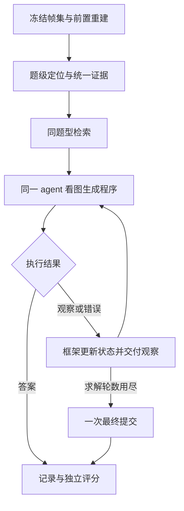

# harness3D 系统架构与实现规格 v9

> 版本：9.0｜日期：2026-09-26｜性质：自包含实现规格。
> 目标：提高 VSI-Bench 表现，验证以真实执行经验驱动的 Skill 自演化。
> 本文整合 v8 中仍适用的合同、本轮已确认决策，以及已生成的八条初始 Skill。与旧架构、问题报告中的建议冲突时，以本文为准。
> 本文规定目标行为，不表示代码已实现、S0 已上线或性能收益已成立。优先复用正确实现，不要求重写全仓库。

## 1. 目标、角色与本版决定

核心研究问题：固定在线模型、输入、工具体系和检索规则后，能否通过真实执行经验修订可复用 Skill，提高未见场景的空间问答表现？核心比较是 **E−S0**：演化后的快照与冻结的初始方法库比较。Skill 数量、工具调用率、晋升次数不是优化目标。

| 已确认决定 | 目标行为 |
|---|---|
| 有图必答、统一程序入口 | 可读图像下不因证据不足语义拒答；同一在线 agent 看图、生成程序，经 ReturnAnswer 提交视觉、工具或混合答案 |
| 重建前置 | 初次检索和程序生成前完成或尝试 VGGT、尺度融合和质量检查；失败也提供明确状态 |
| 状态由框架管理 | 场景基础产物不可变；题级证据、依赖失效、授权与恢复由框架统一维护 |
| 初始对象处理 | 框架先做有限的题面目标定位；不等待完整场景清单，不强制全对象 SAM2 传播 |
| 主动观察闭环 | 新结果经框架更新与 yield，实际内容进入同一在线 agent 的下一轮请求 |
| 简化运行限制 | 配置最大求解轮数；同一失败操作最多重试 3 次；保留一次不可重入的最终作答机会 |
| 简化成本与沙箱 | 只报告首次处理成本；沙箱表示程序执行环境，不要求实现真实安全隔离平台 |
| 八类任务、八条初始方法 | S0 是含八条 Skill 的完整快照；每条只属于一个规范题型，检索先做题型硬过滤 |
| Skill 文件格式 | SKILL.md 为唯一方法源，YAML 文件头加固定 Markdown 正文，自动导出 JSON |
| 演化来源与检索一致 | 修订主要来自真实检索并交付该 Skill 的学习题；未命中题不冒充该方法使用经验 |
| 候选验证 | 固定同题型面板、正常检索、两个固定 seed 配对；发布快照时再做八题型整体比较 |
| 首轮交付终点 | 真实运行及 S0 → 至少两轮真实演化 → 八题型开发 E−S0 比较 |

角色分工：实现 coding agent 核验和修改工程；在线 agent 沿用 Qwen3-VL-8B 生成程序；离线归纳器提出方法候选；框架管理状态、执行和快照；独立评估器持有标签并评分。模型与服务的实际版本由运行配置和收据确定，不因名称相同就假定权重未变。

在线工具不能另行调用答案模型。Skill 演化不改模型权重、感知算法、工具实现、证据阈值、评分器、检索算法或轮数限制。上述系统变更单独版本化，并重新建立可比基线。

## 2. 当前依据与工作范围

本版使用《系统架构v8(1).md》《问题报告v8.md》《系统现状0924.md》、本轮决定及已生成的 S0 文件。尚未访问实际系统源码、服务和原始实验产物。报告中的结论是核验线索，不自动成为本版已验证事实。

| 报告线索 | 实现时的核验重点 |
|---|---|
| 恢复路径调用未定义的 `_invalidate_metric_gate`；最新定向结果为 1 failed、1 passed | 修复当前路径并验证证据、米制门、工具面同步；较早的 2 passed 不代表当前版本 |
| `inspect_frames`、`detect_objects` 未注册，缺少图像回灌链路 | 检查真实调用、状态更新、下一轮实际图片输入 |
| 检测故障可能返回成功空列表；文档与执行授权来源分离 | 明确主返回状态，接入统一授权函数和调用收据 |
| active 可为空并记 genesis，缺真实 S0／候选后续使用证据 | 区分空库、初始候选包、冻结 S0 和已验证演化快照 |
| 不足 32 帧可能硬失败，首轮证据到检索到提示词的 trace 不全 | 核验部分可读输入、完整评估分母和实际方法输入 |
| 0924 报告记录 NumPy／SciPy 导入冲突及 16 个测试收集错误 | 核对现场依赖，修复后重新记录完整测试结果 |

历史分数、样本数量、模型部署状态和凭据状态只代表各自运行时点，不能推导当前系统已接通或已有收益。保留现有工作区改动，先记录 commit 与 patch 身份，再做增量修改；不为获得干净状态覆盖用户工作。

保留 VGGT feed-forward、MoGe-2 跨帧尺度融合、冻结帧集、逐工具权限、坐标合同、来源追踪、场景隔离和离线准入。BA、旧多锚点／GT 标定池继续退役；G5 不启用、G8 不恢复。3DGS、替代重建主干、模型训练、复杂分支搜索、独立向量数据库和自动反例平台不属于首轮必做。

## 3. 总体运行结构

### 3.1 场景前置与题级定位

先冻结 FrameSet，执行或复用 VGGT 重建、MoGe-2 尺度融合、M4 检查与世界系估计。前置阶段在首轮 Skill 检索前形成成功、降级或失败结论；同一失败操作遵循三次重试规则，不无限等待“所有能力齐全”。

缓存按数据、场景、帧集、预处理、模型、参数和生产者版本定位。基础产物不可变并可跨题复用；题级绑定、补检和失效记录独立。前置重建失败后，原图及独立可用的 2D 能力继续供在线求解。

随后由框架解析公开题面目标，复用相关缓存，对缺失目标执行有限初始检测。初始策略使用固定配置中的有限帧／候选集合，不为此建立额外的时间、token、工具配额体系。定位不全、有歧义或服务失败时均进入检索与求解。模型辅助定位若需要 VLM，使用同一在线模型，记录请求和首次成本。

| 题型 | 初始定位或覆盖信息 |
|---|---|
| 计数 | 目标类别候选、跨帧覆盖、重复嫌疑；不以已有一个实例代表类别齐全 |
| 绝对／相对距离、尺寸 | 参照与候选对象角色、消歧描述、已有实例与缺失项 |
| 方向 | observer、facing_at、target 三种角色和难度 |
| 首次出现 | 目标类别、已观测帧、时间覆盖和未搜索区间 |
| 房间面积 | 题面空间范围、已有边界／平面及覆盖；不强制穷举家具 |
| 路线 | 起点、初始朝向、给定途经对象和转向空位 |

检测成功不等于绑定正确或覆盖完整。分割、跟踪与追加检测按后续方法需要执行，不要求所有目标先完成 SAM2 传播。

### 3.2 在线循环与离线循环



原始冻结图片每轮保持可见；几何成功不强迫使用几何工具。框架向模型提供题目、图片、分项证据、实际工具文档和选中的 Skill 正文，不只提供 route 字符串或 Skill ID。

离线链读取允许学习的实际轨迹，按检索命中与使用状态组织经验，生成候选，在同题型固定面板上正常检索并配对验证。接受时发布不可变新快照；拒绝时保留父快照。随后重新运行活跃快照，获得下一轮真实经验。每个 episode 固定一个快照，不在执行中切换。

## 4. 题目适配与答案合同

| 规范题型 | 答案与单位 | 几何方法的主要依赖 |
|---|---|---|
| `object_counting` | 数值，非负整数 | 检测、实例关联与去重；不必依赖 3D |
| `object_abs_distance` | 数值，米；题面两个对象的最近距离 | 对象绑定、相对几何、尺度 |
| `object_size_estimation` | 数值，厘米；对象最长尺寸 | 对象绑定、相对几何、尺度 |
| `room_size_estimation` | 数值，平方米；题面房间或合并空间面积 | 相对几何、尺度、有效边界/平面估计 |
| `object_rel_distance` | 题目给定的合法选项 | 参照对象到候选对象的距离比较；不需尺度 |
| `object_rel_direction` | 对应难度的合法选项 | 对象绑定、世界系与水平朝向 |
| `route_planning` | 题目给定的合法选项 | 题面起点、朝向、途经对象与转向关系 |
| `obj_appearance_order` | 题目给定的合法选项 | 类别首次出现、帧序、必要的检测与关联 |

以上依赖针对具体工具方法；所有题型均保留程序内视觉作答。选项不硬编码为 A–D：使用当前题目提供的合法标签。

Adapter 保留 `raw_question_type`，把官方 10 个原始类型映射为上表 8 类，并单独保留方向难度。映射从冻结数据版本的实际枚举生成且有覆盖测试；未知类型报适配错误，不猜别名。保留题面单位、对象角色和选项映射，禁止把参考对象默认为相机。

题目载荷只含公开输入。标准答案、标注 3D 框、GT 位姿/尺度和评估结果由评估进程隔离持有，不能进入在线提示词、工具或沙箱。

映射表、方向难度和评分分组必须共用单一版本化来源。配置保留 10 个原始类型、主表按 8 类汇总是允许的；禁止静默丢掉 easy／hard 或把未知类型映射成已知任务。

## 5. FrameSet 与输入有效性

### 5.1 正常输入

完整视频时间均匀采样 32 个唯一物理帧，使用冻结的取整算法，记录源索引与时间戳。采样不读题目或答案，基线和消融使用同一帧集、顺序、分辨率政策与 `frame_set_hash`。

M2 改为最小输入有效性检查：文件/像素是否存在、可解码、尺寸合法。模糊、曝光、对比度和运动质量诊断默认关闭；可在独立诊断实验中启用，不能删帧、换帧、重排或终止作答。原有 `quality_weight` 默认不影响主流程。

### 5.2 异常输入

- 全部指定图像缺失或无法解码：`input_error`，记录原因；可重试加载，不生成伪答案。
- 部分帧无法解码，或源视频不足 32 帧但仍有真实可读帧：保留帧身份和缺失掩码，使用可读帧继续作答；不重复填充或偷偷改采样。依赖完整帧集的工具按条件禁用。
- 部分缺帧样本标记 `input_degraded`，独立报告；不伪称完整 32 帧输入，也不从评分分母静默删除。成对实验必须复用同一实际可读集合。
- 全黑、模糊或低对比图像只要结构有效且能解码，不能被质量阈值判定为“没有图片”。

`FrameSet` 至少包含：`schema_version, episode_id, dataset_id, video_id, scene_name, frame_ids, source_frame_indices, timestamps, frame_refs, frame_set_hash, decode_status, readable_frame_ids, preprocessing_version`。数组字段长度匹配，帧索引唯一且有序；源标识及内容校验值参与缓存身份，禁止仅凭相同的帧索引列表跨视频复用。

### 5.3 先冻结清单，再加载输入

评估清单从题目元数据与预登记的 scene／任务采样规则生成，不以视频存在、成功解码或工具成功为筛选条件。随后逐项加载，每个预登记 qa_id 必须有结果行；不足 32 帧不能通过 skip 静默消失。适配错误单独记录，保留总体分母。

开发抽样以 scene 为单位控制覆盖与缓存成本，同时保证任务和方向难度覆盖。禁止默认按文件行序取每类前 N 题后把该子集当成随机代表样本；抽样算法、scene／qa_id 清单、seed 和 hash 都落盘。既有 64／128 题保留为历史回归面板，不因结果不利而重命名为正式 holdout。

## 6. 证据、产物与工具权限

### 6.1 八项证据

每项取 `available / degraded / unavailable`，附生产者、原因、原始数值、阈值版本和证据版本。`unavailable` 可以表示未运行或生成失败，必须通过原因码区分。

| 能力 | 依据 | 降级影响 |
|---|---|---|
| `image_2d` | 实际可读帧 | 完整为 available；部分缺失为 degraded；不受重建失败影响 |
| `temporal` | 源帧序和时间戳 | 只影响需要时间关系的工具 |
| `geometry_3d` | VGGT 产物及 M4 | 只影响需要可信相对几何的工具 |
| `world_frame` | world_up、handedness 及估计依据 | 只影响世界方向和相关路线工具 |
| `metric_scale` | 场景尺度融合与自洽条件 | 只影响米制测量 |
| `object_detection` | 检测执行状态、候选与覆盖诊断 | 检测服务错误不能伪装成场景中没有对象 |
| `object_grounding` | 当前题面对象与实例的匹配 | 题级状态；不修改其他题的绑定 |
| `track_consensus` | 跨帧身份稳定性、重复嫌疑 | 只影响依赖实例关联的工具 |

### 6.2 唯一状态源与派生视图

沿用现有模块组织，不另建复杂状态平台。逻辑上分为不可变的场景基础产物和框架拥有的 `QuestionState`。后者至少保存 `episode_id, base_artifact_refs, evidence_version, question_bindings, additional_objects, result_registry, invalidation_events`。

`SceneState`／`SceneHandle` 是当前题级状态的只读视图。`EvidenceProfile`、逐题米制门、`question_tool_scope`、工具文档和提示词摘要全部从同一个 `evidence_version` 派生，不允许各自维护互不一致的可写状态。

- `artifact_registry` 记录产物 `ref, producer_version, status, dependencies, invalidated_by`。存在但失效的产物保留审计记录，不再授权使用。
- `available_artifacts` 从有效产物和依赖计算；3D 不可用时仍可有 frames、2D masks、objects、tracks、timestamps。
- `scene_route=full_3d / fallback_2d_only` 只是几何摘要，不决定图片是否存在、最终答案来源或具体工具权限。
- `question_tool_scope` 是工具 ID 集合；具体调用的对象、参数和依赖仍在执行前检查。
- 题级结果失效不原地修改共享缓存；需要修正基础产物时发布新版本。

### 6.2.1 失效、反馈与恢复

框架按实际根因确定影响范围：参数错误或一般服务超时通常只是本次调用失败；错误对象绑定撤销该对象及依赖结果；失效尺度撤销依赖尺度的测量，保留无关归一化几何和原图。不能将任何异常都升级为整场景几何失效。

一次状态更新按事务语义完成：记录原因与依赖 → 撤销受影响结果 → 更新证据版本 → 重新派生门、工具面和摘要 → 向模型反馈。实现可复用现有对象与一次提交，不要求新增数据库事务平台。

**恢复能力必须有经过验证的新证据。** 重载同一缓存、重建 SceneState 或重算派生视图，不得清除已有失效记录。新检测只可能恢复其支持的绑定，不能顺带恢复米制尺度。agent 可以提出疑问或请求检查，但不能直接修改证据、阈值和授权；模型怀疑本身不是几何损坏的证明。

证据版本变化不自动废弃全部旧结果，按依赖逐项判断。失效项不得继续计算或列入有效答案依据；若此前已传给模型，下一请求明确列出撤销项并移除过期摘要。

### 6.3 唯一工具授权规则

每个 ToolSpec 声明 `requires_artifacts, requires_evidence, tolerates_degraded, requires_metric_evidence, argument_schema, output_schema, version`。

必要证据为 available 时正常可用；为 degraded 且声明允许时可用并显式标记；必要证据 unavailable 或产物缺失/失效时，仅禁用依赖它的工具。检索文档和执行包装层必须使用同一确定性判定函数，执行时再次校验。

`ReturnAnswer`、`YieldObservations` 是控制接口，不受感知工具证据门屏蔽。即使可用感知工具集合为空，在线 agent 仍接收图片和答案提交接口。

工具前置条件不读取 `paper_eligible` 或历史 CURRENT_BASELINE 常量。方法启用配置独立版本化；开发配置可启用待验证方法，冻结评估配置必须明确列出启用的方法。

### 6.4 授权收据与证据解释

每次实际调用生成同一判定函数产出的 `ToolAuthorizationReceipt`：至少包含 `episode_id, tool_id, argument_digest, evidence_version, dependency_refs, allowed, reason_codes, metric_gate_result, decision_version`。提示词中的工具清单只是当前可发现的工具面；实参涉及的具体对象仍需执行前检查。

米制门是题级且与工具调用相关的判定；非米制工具使用 `not_applicable`，不能用默认 False 伪装失败。`authorized_metric_tasks` 如为旧兼容字段，必须由相同判定来源派生；新增主链以工具收据为准。场景尺度状态、题级米制权限和历史成熟度分别记录。

`unavailable` 的原因至少区分 `not_run / producer_failed / invalidated / unsupported`；成功执行但无匹配目标使用明确的空检出／未匹配状态。服务错误不能伪装成成功空列表。

质量门约束当前工具是否可调用，不能单凭门通过宣称该工具有下游收益。阈值需要开发验证和版本冻结；本版不自动放宽 M4／尺度门来追求调用率。证据摘要中的 available／degraded／unavailable 与授权收据不能互相矛盾。

## 7. 重建、世界系与几何检查

### 7.1 VGGT 与坐标

正式多视图主干为 VGGT feed-forward，记录实际 checkpoint 和代码版本。世界系固定为重建输入首帧相机系，`c2w[0]=I`；正常输入对应冻结帧集首帧。若该帧不可读，使用最早可读帧并显式记录 `reference_frame_id` 与原 FrameSet 索引映射，不能伪称原首帧坐标系。上游 world→camera 外参必须正确求逆。深度、点图、K 与预处理网格对齐，禁止把相机 z 深度直接当作任意两点距离。

VGGT、MoGe-2、SAM2 或检测服务的加载/执行失败，以及预处理超时，均转为对应生产者失败并更新证据，不得在原图可读时阻断进入在线作答。预处理遵循有限重试规则，不因同一故障反复重启整个前置流程。

`ReconstructionArtifact` 至少记录帧集身份、`recon_method="vggt"`、c2w/K/depth/point_map/confidence 引用、world_up、handedness、世界系状态、尺度字段、质量状态、参数及生产者版本。允许重建失败时 artifact 为空，由独立 FrameSet 支撑后续作答。

world_up 由相机位姿束估计，handedness 随坐标适配明确记录；“向量有限”不是方向正确的充分证明。估计不确定、坐标约定缺失或退化时降低 world_frame，仅停止依赖它的工具。

### 7.2 M4 主门与诊断

主门保留两个交叉指标：相邻视图 warp 的相对深度一致性内点率，以及分组点云的双向近邻重叠率。两者均达冻结阈值才放行相关几何工具；质量未计算、计算失败或非有限值均不能记为通过。

warp 光度一致性、轨迹残差、旋转平滑用于诊断，不代替主门。VGGT confidence 先做 conf–warp 单调性自检，再作为软权重；不固定以 `C>2` 作为硬门。

阈值与邻域/采样配置在独立的工程开发阶段确定并冻结；进入 Skill 候选验证后不得再随候选修改。开发验证包括正常样本及抽稀、跨场景混合、模糊等退化注入；退化数据属于独立诊断，不改变正式评估的原始帧集。

`reprojection_status="not_available"`，G5 数值为 None，不参与质量聚合；尚未实现的轨迹残差也记 unavailable，不能用其他量冒充。M4 衡量几何自洽，不证明米制准确性。

### 7.3 前置阶段验收

运行轨迹须证明：重建／缓存身份和质量结论早于首轮方法选择；模型确实接收到分项证据，而非仅收到一个 route 字符串。重建前置遵循同一失败操作最多三次重试的规则；失败后进入可用证据下的求解，不取消最终作答机会。

置信度单调性自检若未真正接入，记录未计算并禁用依赖该自检的置信度加权；允许其他有效计算继续。禁止用仅测试调用的函数或 NaN 桩证明生产诊断生效。

## 8. 度量尺度与实验成熟度

### 8.1 尺度融合

保持 MoGe-2（首选 checkpoint `Ruicheng/moge-2-vitl`）作为单目度量先验，不自动升级模型。使用与图像预处理一致的 VGGT 内参换算水平 FOV；核对所用版本的参数单位、归一化内参以及深度语义 [R10]。

对有效、非黑边且深度为正的对齐像素：`s_k = median(d_metric / d_vggt_normalized)`；跨有效帧稳健融合 `s_global = median(s_k)`。记录有效帧比例、离群处理、原始/保留 s_k、std/median 和 MAD。`metric_scale` 必须有限且为正；尺度不稳定不等于系统拒答。

### 8.2 场景尺度与逐题测量门

场景级 `metric_scale` 状态由融合结果和数值自洽决定，不因题型而改变。逐题 `MetricEvidenceGateResult` 按以下六项 AND 授权米制工具：

1. 当前相对几何可用；读取同版本的实际几何证据，不以 `scene_route` 字符串代替判定。
2. M4 两项主指标通过。
3. 尺度融合成功，有效帧比例达到冻结要求。
4. 尺度离散度达到冻结要求。
5. 当前工具相关的输入、坐标、内参及数值合法。
6. 当前题型属于三个米制数值题，且对应工具声明米制需求。

结果包含 `status, gate_passed, sub_results, values, thresholds, missing_subconditions, gate_version`。`status` 为 pass／fail／not_applicable；非米制工具为 not_applicable 且 gate_passed=None，其余与布尔判定一致。门失败后可继续使用不依赖尺度的工具；程序内视觉估计仍可输出带正确单位的数值，但不能标为测量值。

### 8.3 开发实验与准入

撤销“未完成 PoC 就必须把真实计算的 metric_scale 强制置空”的循环限制。开发实验可保存实际尺度并执行通过当前证据门的测量，附 `validation_stage=experimental`；融合失败本身仍应置空。

尺度研究保留以下开发检查，按实际主张推进，不作为启动 Skill 演化的全套前置门：跨帧稳定性、退化敏感性、M4 配合、三类米制题的配对收益、资源成本、内参扰动敏感性。错 K 的响应需要实际测量，不能把“必定发散”当作事实。Metric3D v2 可作有明确版本/许可证记录的补充对照，不因该对照未完成而禁止 MoGe-2 开发实验；不恢复旧 GT 标定路线。

`implemented / connected / real_poc_verified / paper_eligible` 分别由实现、接线、真实验证和结果资格支撑，不按历史常量永久冻结。资格绑定方法版本、配置和实验；验证无增益可以形成真实负结果，不能被改写成成功，也不能把“可报告”定义为“必须显著提升”。

尺度与几何比较只使用当前可用输入；不得通过观察 GT 标注校正场景尺度。历史 3 场景 PoC、23／24 场景融合成功等只证明各自覆盖范围内的运行现象，不能替代米制题下游收益验证。跨模型对照可补充，但不阻塞以固定 MoGe-2 工具体系开展 Skill 演化实验。

## 9. 对象绑定、2D 能力与几何工具

### 9.1 对象绑定与感知组织

保留检测器、同一在线 VLM 的辅助清单、SAM2 和跨帧实例关联。场景基础清单可复用；题面对象按角色补绑。本版不要求求解前生成全场景完整对象清单，也不因某类别已有一条记录就判定该类别已完整覆盖。

按题型明确需要的覆盖：

- 计数：搜索目标类别的多个实例，处理遮挡后重现和重复 track；单个实例存在不代表计数完成。
- 绝对／相对距离与方向：定位参照、朝向和目标角色；多个候选实例的聚合遵循任务定义。
- 出现顺序：检查冻结帧集中的时间覆盖，记录首次观测与未观测区间；不能把“未检到”当作该时刻不存在。
- 房间面积：单独处理空间边界／平面与覆盖；从可计数物体词表排除 wall／floor，不代表面积方法可以忽略这些结构。

`ObjectRecord` 至少含 `obj_id, category_name, visible_frames, mask_refs, track_id, det_conf, grounding_status, duplicate_suspect`，以及可空的 `centroid_ref, points_ref, bbox3d_ref`。没有 3D 质心仍可保存 2D 对象；SAM2 与 2D 关联不依赖几何成功，3D 仅在授权时辅助。

VLM 0–1000 坐标转换为实际像素；mask 到深度网格使用记录过的裁剪／缩放变换与最近邻插值；点坐标显式声明坐标系。所有变换写入 receipt，不以宽高比代替完整对齐关系。

服务故障、有效空检出、候选稀疏、目标未匹配、截断和重复嫌疑分别记录。故障返回失败，不能以 last_error 旁路掩盖主结果的成功空列表。计数不能直接取清单长度，也不能把故障解释成 0。

对象缓存键包含数据集、场景、帧集、模型／词表、预处理、检测帧、目标类别与算法参数。题级绑定与基础清单分离；题目派生检测结果只有在请求身份一致且无答案信息时才可复用。比较实验不得让某一臂先运行后获得另一臂额外产物或不计成本的预热优势。

历史 `MAX_BASE_DETECTIONS=24`、面积比例 0.45、探测 2 帧、辅助清单 8 个对象、去重 overlap=0.30 均是待验证配置。发生截断时记录候选数与保留策略，对题面目标优先保障；禁止把截断后的清单称为完整。探测／传播策略和本地缓存作为独立开发配置验证，不与 Skill 演化处理同时变更。

### 9.2 最小工具面

表中签名省略由执行器绑定的只读场景句柄；返回均经包装层转为 ToolResult。只展示满足第 6 章规则的工具及合法输出字段。

| 工具 | 必要能力 | 核心合同 |
|---|---|---|
| `inspect_frames(frame_ids, boxes=None)` | image_2d；允许 degraded | 从冻结帧集中查看/裁剪真实图片；返回图像引用和变换，不能新采样视频帧 |
| `detect_objects(frame_ids, categories)` | image_2d 及健康检测服务 | 返回候选、置信度和执行状态；服务健康属于执行前置条件，不要求已有检测成功 |
| `list_objects(category_filter=None)` | object_detection | 返回自描述对象记录及覆盖说明，不把对象 ID 当类别名 |
| `count_objects(category_name)` | object_detection、track_consensus | 按实例共识去重；允许 degraded track，但必须标注重复/遗漏风险 |
| `object_visible_frames(obj_id)` | temporal、对象绑定 | 返回递增可见帧和存在性依据；零检出与未执行分开 |
| `object_centroid(obj_id)` | geometry_3d、对象绑定 | 返回归一化世界坐标；只有通过逐题米制门时才可附米制字段 |
| `surface_distance_between_objects(a, b)` | geometry_3d、对象绑定 | 返回对象点集之间的归一化近邻距离估计和定义版本 |
| `object_distance_m(a, b)` | 上一项及 metric_scale | 最近距离的米制估计；必须使用两个题面对象 |
| `relative_distance_rank(reference_id, candidate_ids)` | geometry_3d、对象绑定 | 比较参照对象到候选实例的距离，按类别聚合最近实例；不需尺度 |
| `object_3d_extent(obj_id)` | geometry_3d、metric_scale、对象绑定 | 输出尺寸、最长维及单位转换依据；官方尺寸答案按题面转为厘米 |
| `plane_fit_room_size()` | geometry_3d、metric_scale | 输出面积、边界/平面拟合质量和覆盖范围；不以对角线冒充面积 |
| `relative_direction_of(observer_id, facing_at_id, target_id, difficulty)` | geometry_3d、world_frame、对象绑定 | 根据对象角色和难度输出方向及角度，再匹配题面选项 |
| `connectivity_graph()` | geometry_3d、world_frame、必要对象绑定 | 返回图与可达性依据，不将欧氏距离直接当作可通行路线 |

`对象绑定` 表示该调用涉及的实例均有有效定位；不要求场景中所有对象都成功绑定。方向与路线相关工具可共享计算原语，但必须尊重题面角色。

### 9.3 距离、尺寸与方向的计算边界

对象间距离从两个对象的有效点集计算双向最近邻集合，使用 KD-tree 等方式避免全笛卡尔积。保留 v6 的低分位稳健估计方向：`q=0.01` 仅为候选，工程开发阶段对比 `q∈{0,0.005,0.01,0.02,0.05}` 后冻结。体素大小、最低有效点数和污染判据也须版本化。

必须区分 `pointcloud_surface_proxy` 与 `bbox_nearest_proxy` 等具体定义。重建可见表面的低分位距离是近似量，不等于官方由对象框产生的最近距离真值；记录系统偏差，不把更换定义后的结果与旧版混报。相机到对象距离可保留为辅助函数，不能自动用于上述两类距离题。

尺度 s 用于长度乘 s、面积乘 s²；相对排序不需要 s。物体尺寸采用与最长维目标一致的框/extent 定义，记录遮挡与方向估计；仅有相机轴对齐框时必须说明近似。房间平面方法输出的是面积估计，需在下游验证覆盖缺失造成的偏差。

方向使用 observer→facing_at 的水平单位朝向 f、observer→target 的水平向量 d 和单位向上向量 u；不同 handedness 先统一到右手系。令 r=f×u、θ=atan2(d·r,d·f)，正角指向右侧。easy 判断左右；medium 在 |θ|≥135° 时为 back，其余判断左右；hard 按前后与左右符号组合成四象限。边界退化、零向量和缺世界系产生受控工具错误，不能静默猜一个方向。

路线按题面给定路径逐段更新面朝方向；“从上一途经点走来”的前向是上一点→当前位置，不能用当前位置→上一点当作前向。方向题 medium 的 135° 分类规则不直接套用于路线转弯；按路线题定义匹配选项。欧氏接近不能证明可通行。

点不足、重复实例、mask 泄漏或污染时，按工具已声明的 degraded 支持输出带标记结果，或报错；不能返回伪精确值。几何结果附 `definition_version, scale_version, q, voxel_size, n_valid_points, degradation_flags`。

### 9.4 主动图像与补检工具接线

`inspect_frames` 和 `detect_objects` 必须验证真实生产调用、真实结果与后续模型输入；注册表中存在其他几何工具不能代替这两项。新检出结果由框架更新当前 episode 对象记录、证据版本和工具可用性；agent 不能直接修改共享状态。

裁剪必须来自同一冻结 FrameSet，并记录源帧、像素范围和变换。模型服务的图像数量／像素上限必须涵盖原图与派生图；不得静默丢图。可使用带明确映射的图像布局或分次观察，实际传入图像、缩放和 token 成本完整记录。仅输出服务器文件路径不算模型已查看图片。

观察链分开记录 `produced / delivered / observed`：产物已生成不代表进入请求；模型收到实际内容并完成本轮响应后，才可记为 observed，且这仍不证明模型正确理解。仅路径、ID 或成功标记不能算看过图。超出模型图像／token 服务上限时，使用事先声明的布局或分批观察方案；未交付的材料保持 unobserved，不静默丢原图或派生图。该服务输入约束不扩展成多维求解预算。

补检、跟踪和绑定在当前求解轮内按有限请求执行，失败仍可回到已有有效证据求解。多个独立检测请求可以批量化，但改变检测器、分辨率或帧覆盖属于实验配置变化，不能静默替换。

## 10. 核心数据模型与提交接口

### 10.1 公共约束

结构化模型使用 Pydantic v2 或等价强校验并拒绝未知字段。架构版本、Skill 源格式、方法版本和运行 Schema 分别管理。本版保留以下核心字段；现有 S0 的 SkillSpec／Snapshot 按 8.0 导出。新增题级状态、检索和演化收据定义为独立的版本化模型；实际仓库若需改变原有字段，必须显式迁移并记录兼容映射，不能仅把 8.0 改标签为 9.0。数值必须有限；缺失用 None 并附状态，不用 NaN 或 0 占位。

```python
CapabilityState = Literal["available", "degraded", "unavailable"]
EpisodeStatus = Literal["answered", "input_error", "run_error"]
AnswerBasis = Literal["visual_estimate", "tool_derived", "mixed"]

class ToolResult(Spec):
    result_id: str
    source_tool: str
    tool_version: str
    status: Literal["ok", "failed"]
    payload: dict | None
    evidence_version: str
    input_result_ids: list[str]
    artifact_dependencies: list[str]
    degradation_flags: list[str]
    error_code: str | None
    invalidated_by: list[str]

class AnswerPayload(Spec):
    value: str | int | float
    unit: Literal["option", "count", "m", "cm", "m2"]
    basis: AnswerBasis
    used_result_ids: list[str]
    derivation: dict | None

class ProgramRound(Spec):
    round_id: int
    trigger: Literal["initial", "observation", "error_recovery", "finalize"]
    code: str
    evidence_version: str
    skill_versions: list[str]
    snapshot_ref: str
    method_summary: str | None
    observed_result_ids: list[str]
    selected_image_refs: list[str]

class EpisodeOutcome(Spec):
    status: EpisodeStatus
    answer: AnswerPayload | None
    failure_code: str | None
    frame_set_hash: str
    active_snapshot_ref: str
    round_trace_refs: list[str]
    budget_receipt: dict  # 兼容字段名；仅保存求解轮数、重试和最终阶段记录
```

`answered` 必须有合法答案；其他状态必须有运行/输入错误依据。`unanswerable`、`abstain`、`tool_contract` 不再是本版的正常 episode 终态或答案来源。工具契约错误留在事件记录中。

工具包装层将参数/前提失败写成 `status=failed, payload=None` 的结果并触发受控错误反馈；生成程序不能将错误文本作为正常测量值。每个失败调用也必须有可追踪的 result_id。

### 10.2 两个控制接口

- `ReturnAnswer(answer: AnswerPayload)`：校验并提交答案，立即结束本轮和 episode。
- `YieldObservations(result_ids: list[str], reason: str)`：结束当前程序片段，将指定结果及必要图像反馈同一在线 agent；不提交答案。

生成程序统一采用 `def solve(ctx): ...` 入口，推荐写 `return ReturnAnswer(...)` 或 `return YieldObservations(...)`。控制接口由 host 实现为不可被生成程序吞掉的终结操作；执行器负责捕获，不是感知工具。

这明确替换 v6 的“ReturnAnswer 只记录但不中止”语义。AST 检查与运行时封锁共同保证：提交后不能再调用工具或提交第二次；yield 后不能继续执行旧片段。缺少终结操作的程序作为格式/执行错误进入恢复，不作为拒答。

零工具程序示例（仅展示接口，不是固定答案策略）：

```python
def solve(ctx):
    # value 是在线 agent 对当前图片的预测。
    return ReturnAnswer(AnswerPayload(
        value=4, unit="count", basis="visual_estimate",
        used_result_ids=[], derivation=None,
    ))
```

视觉推断发生在模型看图、生成代码时；Python 不会因接收到 image_ref 就自行理解图片。需要判断新裁剪图或新工具结果时，必须先 yield，由同一在线模型读取后生成下一段程序。

成功 ToolResult 中，工具声明的必需数值／图像字段必须存在且合法。测量字段为 None、非有限或单位缺失时返回受控失败，不能让 `status=ok` 穿过包装层。缺少可选字段允许 None，但必须由 output_schema 明确定义。

所有 Schema、工具文档、示例与实际返回值采用一致字段。历史短写 `ReturnAnswer(value)` 只可经显式兼容适配器转换并记录，不能在新合同中靠静默猜单位或工具贡献。已废弃键可有版本化别名，不能同时维护冲突定义。

## 11. 求解轮数、重试与最终提交

### 11.1 一轮的定义

一轮是同一在线 agent 生成一个程序、框架执行该程序并取得答案、观察或错误。下一次基于新观察／错误重新生成程序，消耗下一轮。每轮使用干净的程序命名空间；跨轮只通过序列化有效观察和框架句柄传递状态。

配置 `max_solver_rounds` 为正整数；开发起点可取 6，但这不是已验证最优值。另保留 1 次 finalization。前置处理、普通求解和最终阶段分别记录，不把工具调用数、token、执行尝试、CPU 或总耗时再扩展成独立预算系统。一次程序内可以执行多项有限的计算或工具请求。

同一失败操作最多重试 3 次，即首次尝试后至多再尝试 3 次。操作身份由框架按操作类型、规范化参数及有效输入身份确定，跨恢复保留计数；换 request ID、重载状态不能重置。只有输入证据实质变化时才形成新操作。认证、非法参数等确定性错误不必机械重试。

服务层对同一请求的原样重试不创建新的求解轮；改变提示、代码或根据反馈再次求解则计新轮。程序恢复仍受 `max_solver_rounds` 限制，不能靠“三次重试”在每轮之外无限添加恢复请求。记录所有实际尝试与成本。

常规网络客户端超时和已有进程管理可按服务需要保留；本架构不新增分级时间／资源配额，也不声称轮数限制能够终止任意 Python 死循环。首轮交付验证的是框架迭代和重试有界，不要求完成真实安全沙箱的资源隔离证明。

### 11.2 不可重入的 finalization

普通轮数用尽而未提交时，进入一次最终作答阶段。仍由同一在线 agent 接收原图、已观察且仍有效的结果及明确撤销信息，生成最终提交程序。

执行器在此阶段只开放 `ReturnAnswer` 和已允许的纯计算能力；禁止注册感知／探索工具和 `YieldObservations`。限制由执行入口实现，不能仅写在提示词中。最终程序可以直接提交视觉估计，也可以使用已有有效测量；答案依据仍按实际使用区分。

最终阶段只进入一次，不回到普通恢复循环，不增加新的格式修复轮。服务请求本身可以按三次规则原样重试；最终代码仍非法、没有合法提交或服务持续失败时记 `run_error`，保留真实原因。不得自动填 0、固定选项或随机答案。

可读图片下，证据不足不构成拒答理由。模型语义拒答单列 `policy_refusal_violation`；若最终未修复，有图必答行为验收失败，不能改名为运行错误后宣称满足要求。真实输入或服务故障仍保留评分分母。

### 11.3 恢复与观察

工具结果先由框架校验、更新 QuestionState，再通过 `YieldObservations` 交给同一 agent。工具错误也由框架更新状态并形成反馈；agent 不自行修复共享状态。

允许从未闭合代码块提取可完整解析、通过检查且含合法终结操作的前缀，标记 `parse_recovered`；不能补造未生成的答案。纯注释、截断代码、重复文本或无终结操作不能算有效程序。无围栏但完整程序不计解析恢复。

原始冻结图片保持稳定身份和顺序，每轮实际输入记录布局、缩放、派生图映射、结果 ID 和证据版本。模型无法访问的路径不能作为观察完成证据。需要模型判断新图时先 yield，Python 代码不能凭 image_ref 自行理解图片。

## 12. 答案来源与归因

正式在线求解统一 `execution_mode="program"`；V0 仅作为独立评估基线。

| basis | 判定要求 |
|---|---|
| `visual_estimate` | 由原图及非推断性裁剪作答，未使用工具提供的任务事实或测量值；允许之前存在失败调用 |
| `tool_derived` | 可由有效工具结果与可审计变换得到答案，记录实际结果 ID 和变换 |
| `mixed` | 工具事实与视觉／语义判断结合，或无法证明完全由工具推导 |

调用不等于使用；本轮零调用也可能使用了缓存测量。初始清单、预计算及缓存结果一并进入来源账本。裁剪身份可追踪，但裁剪本身不构成测量贡献。

记录 `attempted_tool_calls, succeeded_tool_calls, observed_result_ids, declared_used_result_ids, verified_used_result_ids, ignored_result_ids`。答案声明由框架核验，不仅依赖模型自称。`derivation` 使用可重放的 `op, input_result_ids, parameters`，仅允许登记的字段提取、换算、计数、排序、argmin、选项映射，不执行其中的任意代码。

无法充分验证工具归因时保守记 mixed 并保留问题记录，不凭此否决格式合法的预测；使用已失效证据则按恢复规则处理。最终答对不证明中间工具正确，最终答错也不证明所有步骤无用。

`finalization_used`、`round_trigger`、`basis` 分开记录。报告最终阶段占比及其分组得分；不把所有最终提交自动归为纯视觉。工具或 Skill 的因果贡献靠对照实验衡量，trace 仅提供行为证据。

## 13. 初始 S0、文件格式与检索

### 13.1 S0 的含义和当前状态

**S0 是含八条 Skill 的初始快照，不是八个快照。** 每个规范题型恰有一条初始方法；绝对距离与相对距离分开，方向与路线分开。后续同一题型可以演化多条方法，不能跨题型召回。

已生成 `harness3d_s0_bundle.json`，包含八条源文件、格式与来源说明、生成记录、导出脚本、运行 JSON 和检查收据。coding agent 以该交付作为接入起点，不必从零重新生成八条方法。其候选快照为 `S0-seed-20260925-v1`，八条方法版本均为 `1.0.0`；`runtime_verified=false`、`production_activation=false`。文档／静态检查和合成应用检查不等于真实系统验收。

接入顺序：核对实际接口 → 显式适配 Schema → 验证八题型命中及正文交付 → 允许开发场景的基本真实运行 → 冻结实验 S0。初始化只修复格式、接口和清晰性；一旦依据答题成败优化方法，就属于演化，不能回写为未经学习的 S0。

冻结后的 S0 对照副本保持不变。演化从其副本开始；源方法、示例和教训的修订均产生新版本。不得刻意削弱 S0，也不能把空 genesis 冒充 S0。

### 13.2 八条初始方法的内容与生成依据

表中 VSI、SKILL3D、VADAR、THINK3D 等资料的链接和阅读范围见第 19 章；具体来源已写入各 Skill 的 provenance。

| ID／规范题型 | 源目录／family | 必须包含的方法内容 | 生成参考 |
|---|---|---|---|
| S01 `object_counting` | `count-scene-objects`／counting | 目标类别确认、全冻结帧覆盖、跨帧同一实例去重、重现与遮挡、检测故障／截断检查；证据不足时基于原图估计非负整数 | VSI §3、B.1；SKILL3D §3.1–3.2、附录 D；本地对象与提交合同 |
| S02 `object_abs_distance` | `estimate-object-distance`／metric | 绑定题面两对象、最近距离口径、有效尺度与单位、可见表面代理局限；无测量时基于多视角布局和参照物估计米值 | VSI B.1；SKILL3D 附录 D；VADAR Approach；本地尺度与距离合同 |
| S03 `object_rel_distance` | `rank-object-distances`／relative_geometry | 参照对象到候选距离、同类别最近实例聚合、尺度无关比较、候选遮挡与选项映射；视觉布局比较路径 | VSI B.1、§6.2；VADAR Approach；本地相对距离合同 |
| S04 `object_size_estimation` | `estimate-object-size`／metric | 最长维定义、对象边界与遮挡、有效 extent、米到厘米转换；视觉参照尺寸及透视检查 | VSI B.1；VADAR Approach；本地尺寸合同 |
| S05 `room_size_estimation` | `estimate-room-area`／metric | 空间范围、地面边界／平面与覆盖、面积而非对角线、尺度平方；不规则／合并空间和视觉估计 | VSI B.1；SKILL3D 项目 Room Size 案例；本地面积合同 |
| S06 `object_rel_direction` | `judge-relative-direction`／relative_geometry | observer／facing_at／target、水平坐标转换、三难度、零向量与边界；视觉重建站位和朝向 | VSI B.1；THINK3D 3D Transformation／Spatial Reasoning Agent；本地方向合同 |
| S07 `obj_appearance_order` | `order-first-appearances`／appearance | 类别首次观测、稳定时间顺序、早期缺检／遮挡、采样分辨率；原图时间轴复核与选项匹配 | VSI B.1；SKILL3D 项目 Appearance Order 案例；本地帧与时间合同 |
| S08 `route_planning` | `infer-route-turns`／route | 给定起点和朝向、途经对象、逐段更新方向、转向序列；不把欧氏距离当可通行性；自带方向步骤 | VSI B.1；THINK3D 3D Transformation；本地路线／方向／提交合同 |

各方法包含视觉与有效工具路径，通过步骤局部条件切换，不为每个证据状态拆出一条 Skill。S08 自带路线所需的方向方法，不能通过跨题型检索 S06 补齐。

### 13.3 唯一编辑源与导出文件

| 路径 | 用途与编辑规则 |
|---|---|
| `skills/<name>/SKILL.md` | 唯一可编辑的方法源；一目录一方法 |
| `runtime/skill_specs.json` | 自动导出的 SkillSpec 数组，不手改 |
| `runtime/snapshot.json` | 自动生成的快照和兼容性信息 |
| `runtime/source_manifest.json` | 源文件与导出内容的校验关系 |
| `generation_record.json` | 生成范围、输入身份、用户决定、可核验模型信息 |
| `SOURCES.md` | 资料链接、阅读章节和适配边界 |
| `scripts/build_s0.py` | 当前初始包的确定性校验／导出器 |
| `validation/*.json` | 对应类型的检查收据，明确真实／合成／未运行状态 |

采用 Agent Skills 的 YAML 文件头加 Markdown 正文布局；题型硬过滤、证据规则和 SkillSpec 映射是本项目自定义合同，普通客户端不会自动执行这些约束。`allowed-tools` 不用于授予权限。

文件头与当前 S0 一致：

```yaml
---
name: estimate-object-distance
description: 用于 object_abs_distance 的对象间绝对距离估计。
metadata:
  harness3d-skill-id: "S02"
  harness3d-version: "1.0.0"
  harness3d-question-type: "object_abs_distance"
  harness3d-family: "metric"
  harness3d-source-format: "1.0"
  harness3d-validation: "document-checked-runtime-pending"
---
```

`name` 与目录一致，metadata 值全部为字符串；ID 稳定，方法修订递增 version。题型字段只能是八个规范类型之一。family 是组织标签，不是检索权限。

正文使用固定二级标题，按以下顺序保存：

| 标题 | 格式／内容 | 导出字段 |
|---|---|---|
| 目标 | 简洁文本 | `goal` |
| 适用条件 | 方法适用范围 | 与执行约束合为 `applicability` |
| 执行约束 | 工具、状态、观察、轮数及提交合同 | `applicability` |
| 证据条件 | fenced YAML | `hard_requirements`、`evidence_preferences` |
| 求解步骤 | 有序编号；局部条件写在对应步骤 | `steps=[{step_id,instruction}, ...]` |
| 提交前检查 | Markdown 项目列表 | `checks` |
| 代码示例 | fenced JSON 字符串数组 | `code_examples` |
| 失败教训 | fenced JSON 字符串数组 | `failure_lessons` |
| 局限 | Markdown 项目列表 | `limitations` |
| 答案依据 | fenced JSON 枚举数组 | `supported_answer_bases` |
| 来源 | fenced YAML | `provenance` |

八条初始 Skill 的整体硬前提统一为：

```yaml
hard_requirements:
  image_2d: [available, degraded]
evidence_preferences:
  preferred:
    - 与本方法相关的可靠证据
  local_requirements:
    object_distance_m:
      - geometry_3d
      - metric_scale
      - 两个实例有效绑定
      - 当前米制调用获准
  visual_route: 根据原图和可靠参照进行视觉估计。
```

上述偏好示意采用 S02 的局部工具条件；其余方法按实际需要填写。几何、尺度、world_frame、绑定和轨迹共识不能因某个可选步骤需要而提升为整条初始 Skill 的硬门。局部字符串是方法指导，最终授权读取 ToolSpec 和当前状态，不能由文本解释器自行放权。

初始 `code_examples=[]`、`failure_lessons=[]`。步骤中的公式、检查与局限属于初始设计知识，不伪装成真实执行教训。后续有真实经验时可增加经过验证的示例和教训，不应永远强制为空。

来源最少采用当前 S0 的结构：

```yaml
origin: document_grounded_seed
source_refs:
  - ref: VSI
    sections: [B.1]
    use: 任务定义与单位
source_trace_refs: []
source_split: not_applicable_no_trajectory_induction
label_access: false
parent_skill_versions: []
candidate_record_ref: null
inducer_config_ref: generation_record.json
validation_decision: document_checked_runtime_pending
```

附录 A 收录当前 S02 完整源文件，可直接核对标题、列表、JSON 和 YAML 的具体写法。其他七条完整方法保存在已交付 bundle 中；不把整个 bundle 送入在线模型上下文。

### 13.4 运行模型与版本关系

```python
class SkillSpec(Spec):
    skill_id: str
    version: str
    family: Literal["counting", "metric", "relative_geometry", "route", "appearance"]
    applicable_question_types: list[str]  # 本版强校验为恰好一个规范题型
    goal: str
    applicability: str
    hard_requirements: dict
    evidence_preferences: dict
    steps: list[dict]  # 至少 step_id、instruction
    checks: list[str]
    code_examples: list[str]
    failure_lessons: list[str]
    limitations: list[str]
    supported_answer_bases: list[AnswerBasis]
    provenance: dict

class SkillSnapshot(Spec):
    snapshot_id: str
    parent_snapshot_id: str | None
    generation: int
    skill_versions: list[str]
    manifest_hash: str
    validation_receipt_refs: list[str]
    compatibility: dict
```

| 版本 | 当前含义 |
|---|---|
| 架构 9.0 | 本文的目标行为与实现要求 |
| 源格式 1.0 | SKILL.md 元数据、固定章节与转换规则 |
| 方法 1.0.0 | 当前每条初始方法的内容版本 |
| 导出 Schema 8.0 | 现有 S0 按 v8 目标 SkillSpec／Snapshot 导出，不等于实际代码已兼容 |
| 实际运行兼容版本 | 接入时核验工具、Schema、检索器、证据规则和仓库 revision 后填写 |

不因本文升到 v9 就机械改现有 JSON 标签。实际结构不兼容时写显式适配器，保留源包与迁移收据；已存在的真实运行结果不改标签。来源文本中的 LOCAL_V8 是真实生成依据，也不篡改为尚未用于生成的文档。

现有 `build_s0.py` 对八条 ID、初始版本及内容约束的硬编码仅适用于 S0 bootstrap。演化接入前扩展通用、版本化导出器：允许同题型新增、修订、合并与停用，允许非空示例和教训；仍要求单题型、来源合法、Schema 一致、派生文件不陈旧。不能让“永远只有八条、永远 1.0.0”阻断真实演化。

### 13.5 硬隔离检索

顺序固定为：Adapter 得到规范题型 → 精确过滤该题型分区 → 检查整体 hard_requirements → 在分区内按适用性、当前证据偏好与方法相关性排序 → 选取并交付完整方法正文。禁止全库 top-k 后才丢弃其他题型。

初始每分区只有一条，有可读图像时该条可以召回；缺尺度、缺绑定、重建失败不能屏蔽其视觉方法。后续新增同题型方法才产生竞争。初版可使用确定性规则排序，不要求向量数据库；相同分数使用稳定 ID／版本顺序。

top-k、排序规则和方法上下文上限在演化开始前写入配置并冻结。开发起点可取 top-k=1；该值是起始配置，不是性能结论。上下文放不下时先减少完整条目，不能截掉检查、局部条件或来源后仍称“完整 Skill 已交付”。超过服务限制的候选在静态检查中拒绝或修订。

无匹配方法时使用基础指令继续求解。证据更新后可在同一快照中重检索，更新实际交付记录；不在 episode 中发布新库。Skill 中建议工具不扩大实际权限。

### 13.6 命中与使用记录

每次检索记录规范题型、evidence_version、候选及过滤原因、排序分数、选中版本、实际交付版本与正文 hash、配置版本。区分“检索选中但未送达模型”与“已交付”。经验资格中的命中指至少一轮实际检索并交付方法。

记录 `retrieved_skill_versions`、`delivered_skill_versions`、`declared_selected_skill_versions`、可观察的程序使用线索，以及每轮短方法摘要。模型自称选择要与程序和观察交叉检查，不能当作方法成功或因果贡献的充分证明；无需私有思维链。

## 14. 检索约束下的真实 Skill 演化

### 14.1 数据权限与经验资格

数据按 scene 分为 learning／induction、inner_validation、outer_holdout、final_test，同场景的题、图片、缓存和派生产物跟随划分。学习场景与 inner 验证场景严格分离。

| 学习题与 Skill 的关系 | 可用于什么 | 不能推断什么 |
|---|---|---|
| 已检索交付、被选择且有程序使用线索 | 分析步骤、证据选择、执行结果和重复失败，作为该 Skill 修订的主要经验 | 最终得分不单独证明 Skill 的因果贡献 |
| 已检索交付、未被选择 | 分析描述、适用条件、竞争与可用性 | 不把本题成功／失败归为该方法执行效果 |
| 未检索或未交付 | 同题型的覆盖缺口可提出新方法或扩大适用范围，另记来源类型 | 不冒充该 Skill 的使用经验 |

一题可同时命中多条 Skill，每条分别记录交付、选择和使用状态，不复制成多份独立样本。当前 S0 每题型一条，经验天然按实际命中的该题型积累。

离线归纳器可读取 learning 的公开题面、实际图像或明确标注的摘要、证据、交付方法、程序、工具结果、错误、预测和评估反馈。学习题标签允许用于离线分析并记 `label_access`；GT 3D 框、位姿和尺度默认不提供，不进入在线测量或标定。

inner 的逐题题目、图片、标签、轨迹和错误分析只留在验证器，不交给归纳器修订。归纳器只获得聚合得分／失败统计及接受或拒绝决定；不能通过检索记录、调试日志或候选报告绕过该限制。outer／final 的任何评估反馈都不回流学习。

方法素材分别标记：方法成功、视觉纠正错误工具、工具失败但最终答对、接口错误、证据失效、格式错误、任务答错。接口未实现、字段错误、依赖冲突等工程故障先修工程，不能虚构为可复用方法教训。工程版本改变后重跑受影响基线，保证归因条件一致。

### 14.2 候选内容与至少两轮迭代

每轮先冻结父快照、learning 来源清单和系统配置，按题型与重复问题组织经验。优先修订已有 Skill；只有独立有用的方法或覆盖范围才新增同题型条目。合并或停用也需候选验证，不通过跨题型合并突破硬隔离。

候选至少记录：

```text
candidate_id, operation, canonical_question_type,
parent_snapshot_id, parent_skill_versions,
source_trace_refs, source_split, experience_relation,
hypothesis, patch, expected_scope, expected_effect, known_risks,
inducer_receipt_ref, static_check_ref
```

修订提供实际 diff；移除题号、场景身份、样例答案、固定答案常量及无关轨迹细节。可以保留方法公式、条件和通用示例。仅写“调用工具，失败看图”不能作为有效新增方法。

首轮交付至少完成 **两轮真实演化**：当前活跃快照运行 learning → 归纳实际候选 → 验证并决定 → 活跃快照再实际运行 → 基于随后产生的经验提出下一轮候选并决定。不能把同一批旧轨迹重复提交两次算两轮。

若首轮全部拒绝，第二轮继续从父快照的新实际经验学习；不强制每轮晋升或新增。配置最大演化轮数，开发起点为 2；更多轮数必须在实验开始前声明。候选按预定有限列表顺序验证，候选模型不能无限自行递归追加分支。本版不要求复杂搜索树或多维离线配额。

### 14.3 同题型配对验证

候选只在它所属规范题型的固定 inner 面板上准入。面板在查看候选结果前按场景与覆盖规则确定，方向题包含 easy／medium／hard；记录完整 qa_id 清单、scene、hash 与两个固定 seed，开发默认 seed 为 0、1。面板数量由实际可用场景预登记，不以“每类前 N 行”代替抽样。

父快照与临时候选快照使用同一正常检索器，禁止强行注入候选。模型、原始帧、初始产物、公共提示词、工具、证据阈值、检索配置、轮数和重试规则一致；只有 Skill 快照变化。初始缓存身份相同，方法触发的后续工具行为可以不同并记录首次成本。

设固定同题型面板为 P，父快照与候选快照中目标方法实际交付的题集为 H_parent、H_candidate。修订／合并以被替换的目标方法谱系为对应关系；新增方法的父侧为空集。

- 主准入得分始终在整个 P 上计算，保留所有失败与无命中题。
- 另报 `H_parent ∪ H_candidate` 的配对结果，及共同、失去、新增命中覆盖。
- 不能只挑候选成功命中的题，不能仅固定父快照原命中集合，也不能为了评估方法效果绕过检索强制加载。
- 命中并集只作覆盖与行为诊断，不替代预先固定的同题型分母；未命中候选的题仍可能受方法竞争影响。

这样，候选的经验来自真实可触达范围，而适用性改动导致的新增／丢失覆盖也能被验证。

### 14.4 单一、确定性的准入规则

静态检查先验证格式、来源权限、无样例泄漏、单题型、工具合同、正文长度和可执行示例（若有）。不合格记 quarantine；结果不完整或不能配对时记 validation_incomplete，不得晋升。

对有效配对，两个 seed **分别**满足下列条件才 promote：

1. 整个同题型 P 的官方任务得分严格提高，即 Δscore(seed)>0；数值题用 MRA，选择题用 accuracy。
2. `run_error` 数量不增加；同一固定输入清单下，输入错误差异作为配对有效性问题核验，不可删题。
3. 没有 Schema、来源或工具权限违规。

任一 seed 不提高、持平或运行失败增加则 reject，记录原因。成本只报告，不设置额外成本准入门；单候选不要求重跑八题型、不增加其他题型的逐项回归门。小面板的两次正差不等于统计显著或独立泛化证据。

候选生成器不能修改评估器、规则或自行晋升。唯一验证入口生成 receipt，保存父／候选身份、面板、配置、配对得分、失败数、命中变化、成本和决定。详细逐题结果仅验证器可读，归纳器收到聚合反馈。

多个候选串行验证时明确每次父快照；前一候选接受后，后一候选以新父为准。组合多个改动需重新验证，不能相加单候选收益。发布以原子方式切换 active 指针，新 episode 才加载；保留旧快照和回滚能力。拒绝候选不得进入活跃检索库。

### 14.5 验证复用、服务与 Memory

重复使用 inner 选择方法属于开发优化。冻结面板、准入规则和最大轮数，保存所有拒绝与尝试；不能因候选不通过而改面板或降低门槛。独立收益在快照冻结后的 outer／final 检验，不按 final 分数选代或 seed。

离线服务沿用 v8 配置意图：DeepSeek provider、`deepseek-flash` API 别名；历史文档称其对应 DeepSeek-V4.1-Flash。该历史映射不视为当前服务事实。运行前核验可用模型，记录请求 ID、实际返回模型／指纹（若提供）、日期、采样与 thinking 配置、提示词 hash；版本变化不静默混合实验。

认证从环境或密钥管理注入，不进入源码、Skill 或 trace。服务失败最多按三次规则重试；不可用则保留待处理工作，在线继续使用现有快照，不能用 mock 伪造归纳。

工作记忆只有当前题有效观察；经验记忆保存允许学习的真实轨迹；语义记忆保存已准入 Skill。几何缓存单独管理，不跨题缓存答案。holdout 输出可以归档，但不能被学习检索器访问。

可保留对象 ID 重命名、坐标／单位变换等有明确不变量的定向检查；不要求完整自动反例系统。合成检查用于接口与性质验证，不能补足真实演化轮数或真实晋升证据。

## 15. 执行环境、模型与配置

### 15.1 沙箱的本版含义

“沙箱”仅指承载生成程序的受控执行环境这一概念。首轮实现复用当前可用执行器、注册工具、控制接口、参数校验和必要程序检查；**不要求部署容器或独立安全沙箱，不要求 CPU、内存、进程配额及安全隔离证明**。

执行语义仍需正确：程序只通过已注册接口使用工具，不自行调用模型、不修改框架证据、不读取标准答案；ReturnAnswer／YieldObservations 结束当前片段，finalization 关闭探索接口。每轮命名空间重建，观察与合法句柄由框架传递。现有有效检查可以保留，但不能把平台安全工程变成 Skill 演化的前置项目。

数据权限靠明确载荷、接口和组件分工落实：在线只收到本题公开输入与合法产物，标签由评估器持有；不向在线上下文或工具句柄暴露完整标注。该逻辑访问约束不能被描述成已经验证过的对抗性系统隔离。

### 15.2 模型、部署与依赖

在线沿用 Qwen3-VL-8B，记录实际权重、量化、服务名、采样和图像配置。检测器、SAM2、VGGT、MoGe-2 固定版本；FP8 等部署状态以现场核验为准。图像服务上限和普通客户端设置记录在配置中，不当作复杂研究预算。

沿用分卡部署思路；两张 4090 不视为统一显存池。资源冲突通过调度和合法场景缓存处理，不静默删图、关闭能力或换模型。必要服务失效按证据合同降级并记录。

统一 Python 与 NumPy／SciPy 等依赖及 CLI 的包导入方式；preflight 检查模型、检测服务、视觉权重、离线服务和图像输入。失败与跳过明确报告，不自动切 mock。无需先通过全仓库 lint 或清理所有历史模块，但当前功能合同所需测试必须能实际执行。

### 15.3 最小配置

配置集中记录模型与设备、帧采样／图像布局、几何／尺度／距离参数、初始定位策略、工具服务、Skill 源与快照、检索、执行器、数据划分与面板、评分版本、seed、输出位置，以及：

```yaml
max_solver_rounds: 6       # 开发起点，实验前冻结
max_retries_per_operation: 3
finalization_rounds: 1    # 不可重入，不另加格式修复轮
max_evolution_rounds: 2   # 首轮交付至少完成两轮真实迭代
candidate_validation_seeds: [0, 1]
```

六轮求解和具体 seed 编号是实施起点；三次重试、一次最终机会、两 seed 配对准入及至少两轮真实演化落实本轮决定。不要重新引入 `max_tool_calls`、分级 token／CPU 配额、成本比准入或强制 Docker 门。

## 16. 评估、对照与首次成本

### 16.1 评分与分母

四类数值题使用冻结官方 MRA：对 g>0，`rel=abs(p-g)/g`，对 `theta=linspace(0.5,0.95,10)` 计算 `mean(rel <= 1-theta)`。不得随意替换分母；不支持的标签情况按冻结官方代码核验后处理。四类选择题使用官方选项解析与 exact match。

主表八任务等权宏平均；保留各任务得分和方向 easy／medium／hard 明细，方向聚合遵循冻结上游实现。评分器、边界、选项解析和聚合必须对固定上游版本核验，不把当前文档公式当作已完成实现验证。[R1][R2]

评估清单在加载输入前冻结，每个 qa_id 有结果行。input_error、run_error、无答案和格式错误记 0 并单列原因；少帧、无尺度、world_frame 降级不删分母。按状态的条件得分只是附加诊断。

同表报告得分、合法答案率、失败数、basis 分布、最终阶段占比及首次成本。工具成功率与答题收益分开，不将成功生成尺度或点云视为准确率提升。

### 16.2 划分和面板

learning／induction 用于经验与候选；inner 用于冻结规则下的候选选择；outer 用于冻结方案验证；final 用于最终盲评。工程参数若在 inner 的早期开发阶段调过，记录访问并在演化前冻结；其后不把 inner 逐题材料交给归纳器。历史已用场景不能通过改名恢复盲测身份。

单候选使用第 14 章同题型面板。完成一阶段快照发布或开发比较时，使用预登记的八题型完整开发面板报告总体和各题型结果；不将这一全局报告要求施加为每个单候选的八任务验证门。

首轮开发 E−S0 使用两个固定 seed 成对运行八题型面板，包含方向三难度。记录独立 scene、qa_id 与重复次数；同一题多 seed 不算新独立样本。样本规模按实际资源预登记，不暗示小面板代表完整 benchmark。

VSI-Bench 内部学习采用自定义场景隔离协议，所有比较方法在相同 holdout 重跑。不能将内部学习后的结果称为未经 benchmark 开发的官方全量零样本成绩。

### 16.3 核心实验臂

| ID | 配置 | 用途 |
|---|---|---|
| V0 | 原生视觉模型直接输出，无 Skill／工具结果 | 常规视觉基线，仅在评估驱动中使用 |
| V1 | 同模型经统一程序提交，无 Skill／工具任务事实 | 程序接口影响 |
| T0 | 前置重建、初始定位、工具和反馈，无 Skill | 工具与观察基线 |
| S0 | T0 加冻结非空初始快照 | 静态方法库基线 |
| E | 与 S0 相同外部系统，使用预先选定的演化快照 Sk | 自演化系统 |

核心必做 **E−S0**；同时保留 E−T0、E−V0、V1−V0，T0−V1 和 S0−T0 用于解释。首轮交付必须完成开发 E−S0，其他基线可在同一实施阶段准备；论文正式归因按实际主张完成所需对照。

V0／V1 使用相同冻结帧、在线模型、题面与评分，不接收几何摘要、检测清单或学习方法，也不必执行无用重建。T0／S0／E 使用相同前置处理和初始产物，程序臂求解轮数和重试规则一致。

S0 与 E 唯一处理差异是 Skill 快照；由方法触发的后续补检、工具选择和轮数使用可以不同，并记录为行为差异。不能同时扩词表、换模型量化、调整图像分辨率或证据阈值后归因给 Skill。

### 16.4 只报告首次处理成本

本版只要求首次处理口径，不要求缓存命中、预热或按题摊销的多套报告。对每个冻结评估清单，纳入该方法完成首次处理所需的解码、场景重建／尺度、初始定位、模型请求、工具执行与重试；无用阶段不强加给 V0／V1。

清单内每个唯一场景的必要基础产物计一次；逐题或逐轮新增计算按实际发生计入，避免重复累加。报告总耗时／请求／token／工具次数及可获得的费用，分清场景前置与在线求解。若展示平均值，注明它只是同一首次总成本除以固定题数，不另建缓存摊销实验。

为了配对复现可以复用不可变基础产物，但对每个方法的首次成本均纳入其生成收据，不能把已有缓存记作零预处理成本。题目条件感知缓存隔离，禁止某臂免费使用另一臂追加发现；相同初始共享产物需统一准备与计入。

离线演化另报首次完成该次演化实验的归纳与验证成本，以及候选、轮次和验证样本次数。成本如实报告，不作为候选准入阈值，不要求冷／热／摊销三套实验。

### 16.5 结果解释与独立评估

开发曲线标明 inner 重复选择，保存全部候选、差异、拒绝和晋升。可选机制消融包括仅新增不修订、去掉失败经验、关闭成功路径主动观察；在核心闭环后按论文主张选择，不要求首轮全部完成。

正式独立比较保留逐题／scene／seed 配对结果，按 scene 聚类重采样并重新计算同一八任务宏平均差，报告差值、95% CI、各任务与 seed 波动。小样本、不足任务支持或非正收益如实说明；开发两个 seed 均提高不自动构成论文显著性。

`implemented / connected / real_poc_verified / paper_eligible` 分别由实现、接线、真实运行和本次实验材料支持。工具授权不读取这些资格；paper_eligible 也不要求正结果。E 是否提高 S0、完整系统是否提高 V0，以及方法行为为何变化，是不同结论。

若候选全部拒绝，最终活跃快照仍是父快照，E 与 S0 可能相同；如实展示，不改名伪造演化版本。工程闭环可以完成，但性能收益尚未验证。

## 17. Trace、迁移与待核验项

### 17.1 最小真实记录

| 层级 | 必须落盘 |
|---|---|
| RunManifest | commit／工作区 patch、环境依赖、数据划分与评分版本、模型／工具、配置与提示词 hash、seed、实验臂、执行后端、轮数与快照 |
| 场景 | FrameSet、重建与尺度身份、质量值／阈值、世界系、生产者、失败原因、首次生成成本；完成早于首轮方法选择 |
| Episode | 预登记 qa_id、规范题型／难度／单位、初始与最终证据版本、对象覆盖／绑定、答案／basis、失败、首次成本 |
| 检索与 Round | 分区、候选／过滤／排序、实际交付正文 hash、选择与使用线索、图像布局、实际观察、程序、状态版本、轮数／重试／finalization |
| Tool | 参数、统一授权收据、ToolResult、依赖、失效、图像变换、产生／交付／观察状态、耗时；失败也有 result_id |
| Evolution | 真实经验关系、来源划分／label_access、父版本／候选 diff、同题型面板与两个 seed、命中变化、配对结果、决定、发布与后续实际使用 |
| 数据访问 | split、用途、组件角色、运行／候选身份、输入清单 hash、时间；生产入口实际记录 |

trace 能回答：方法是否真的送达，工具是否真的执行，新图是否进入下一请求，哪条证据何时失效，候选是否在正常检索下改善同题型完整面板。不能仅用配置开关或模型自称代替这些证据。

### 17.2 迁移

保留 v6／v7／v8 原结果与 Schema 身份。旧状态和字段由独立适配器读取，正式新结果使用当前有效合同。旧拒答终态只在历史加载器保留，不出现在正常新枚举中。

旧重建可在帧集、生产者、坐标和尺度定义匹配后复用；旧错误语义派生结果失效，无关原始产物不必重算。清理 CURRENT_BASELINE 对 GT 尺度、退役模块或过期 readiness 的强制依赖；不以历史常量阻止当前真实计算。

现有 S0 源文件保留真实来源和生成状态；适配后的运行快照记录实际仓库与合同版本。仅八条方法导入成功不等于 S0 冻结，更不等于自演化已完成。

### 17.3 编码前核验清单

对第 2 章报告线索逐项给出 confirmed／refuted／unresolved、代码位置和运行依据，重点包括：状态恢复 NameError、失效后错误恢复授权、主动裁剪／补检缺口、检测故障空列表、少帧输入、完整评估分母、首轮方法交付、空 genesis、Schema／工具字段、依赖环境和当前工作区身份。

报告要求的复杂预算和真实隔离已由本轮决定替换，不再以旧 I14 或旧预算验收阻断交付。仍需核验控制接口、三次重试、轮数、最终阶段不重入及标签不进入在线输入。历史得分不能代替这些当前行为的证据。

## 18. 实施顺序与完成定义

| 阶段 | 必做工作 | 交付证据 |
|---|---|---|
| 1：真实运行与 S0 | 核验报告并修阻断；统一状态与权限；初始目标定位；主动观察回灌；八条 Skill 按题型加载 | 八题型真实模型求解覆盖、实际方法正文输入；至少一条真实 crop→下一模型请求→下一程序→答案链；S0 冻结记录 |
| 2：真实演化 | 从实际命中学习题提取经验；实际修改方法；同题型两 seed 正常检索配对；接受／拒绝与版本发布 | 至少两轮真实经验—候选—决定链；第二轮来源是随后实际运行；若晋升，提供后续加载／检索证据 |
| 3：开发 E−S0 | 固定外部系统，在八题型预登记开发面板成对比较 | 总体／各题型得分、失败、首次成本、候选差异与可观察行为变化；如无收益明确报告 |

最小运行合同打通后立即开始演化，不等待所有感知工具优化完成，不要求 T0 先超过 V0。第二阶段可与非阻断工程优化并行推进，但用于归因的系统版本必须固定；换版本时重建相应对照。

不能把“八条静态 Skill 已安装”当交付终点。不能延后真实方法修改、候选决定、版本管理和后续使用；复杂搜索、数据库、大规模消融、自动反例和新工具可延后。

### 18.1 有区分力的验收

| 场景 | 预期行为 |
|---|---|
| 模糊／黑暗但可读，少帧／部分缺帧 | 使用可读原图继续，记录降级；全不可读才 input_error；预登记结果不丢失 |
| 重建／尺度失败 | 只关闭相关工具，八条 S0 的视觉路径仍可按题型检索 |
| 绑定错误、尺度失效、普通超时 | 分别按依赖撤销；重载旧缓存不能恢复被撤销权限；无关证据保留 |
| 健康空检出、服务故障、截断 | 主结果状态不同；故障不变计数 0，不声称截断清单完整 |
| 裁剪与歧义结果 | 实际像素／payload 进入同一 agent 下一请求，正确标记 produced／delivered／observed |
| 达到轮数、持续同操作失败 | 普通恢复不超轮数；同操作最多三次重试；最终阶段进入一次且不再探索 |
| 提交或 yield 后还有代码 | 不继续执行工具，不重复提交 |
| 八题型与几何条件 | 硬隔离先于排序，路线不调用异题型 Skill，局部几何条件不变成全方法硬门 |
| 未命中、命中未选择、命中并使用 | 分开归档经验；不把未用方法与最终成败建立虚假归因 |
| 候选扩大／缩小命中 | 正常检索；同题型完整分母不变；报告父／候选命中并集及失去／新增覆盖 |
| 持平、单 seed 改善、失败增加 | 按统一规则拒绝；不临时换 panel、改 seed 或放宽门槛 |
| 晋升、拒绝与回滚 | 父快照不可变；新 episode 才切换；拒绝候选不可检索；真实后续加载可核验 |
| inner／holdout 数据 | 归纳器无 inner 逐题轨迹；outer／final 不回流经验与方法 |

针对具体风险写必要单元、集成与故障测试，避免仅复述实现的测试堆积。真实模型／工具请求、主动图像链和候选验证不能由 mock 代替。测试报告区分收集、执行、通过、跳过和失败，不拼接历史局部通过结果宣称当前全绿。

### 18.2 工程完成与研究结论

首轮交付包含代码、配置、迁移说明、真实运行命令、必要测试结果、Schema／trace 样例、S0 与候选／快照、两轮记录及开发比较。未接通、未运行、全部拒绝或没有收益均明确报告。

首轮不使用 final_test 做工程验收。之后冻结 Sk、系统、面板与统计计划，再独立评估。工程闭环完成不代表研究主张成立；无收益时保留真实负结果，继续在允许开发范围研究，不伪造晋升或换 mock。

## 19. 来源与方法适配

以下是已有架构及 S0 使用的公开依据，不是本系统性能证据。本版整合已记录的阅读与生成范围，不宣称重新运行论文方法或核验当前服务。实现时固定代码、数据和模型版本。

| 编号／S0 引用 | 资料 | 使用范围与边界 |
|---|---|---|
| R1／VSI | [Thinking in Space](https://arxiv.org/html/2412.14171) | §3、B.1 的八任务定义、单位和方向难度；§6.2 相对布局。仅提取公开规则和通用方法 |
| R2 | [VSI-Bench 官方仓库](https://github.com/vision-x-nyu/thinking-in-space) | 任务适配、评分与参考协议；实际实现需冻结上游 commit 核验 |
| R3／SKILL3D | [Skill-3D](https://arxiv.org/html/2606.07436) | §3.1–3.2、附录 D 的工作流、边界和去重思路；不复制库、案例答案和训练过程 |
| SKILL3D_PROJECT | [Skill-3D 项目页](https://skill-3d.github.io/) | Qualitative Cases 的 Room Size／Appearance Order 证据组织；不纳入实例答案库 |
| VADAR | [VADAR 项目页](https://glab-caltech.github.io/vadar/) | Approach／DFS Method Implementation 的定位、计算、比较组合；不引入动态工具授权 |
| THINK3D | [Think3D](https://arxiv.org/html/2601.13029) | Framework Overview、3D Transformation 的视角转换和反馈；不照搬按需重建或新视角渲染，保持冻结帧集与重建前置 |
| AGENT_SKILLS_SPEC | [Agent Skills Specification](https://agentskills.io/specification) | SKILL.md、YAML＋Markdown、字符串 metadata；题型硬隔离与运行导出是本项目规则 |
| R10 | [MoGe 官方仓库](https://github.com/microsoft/MoGe) | 相机输入、FOV 与深度语义；核验实际所用版本 |
| R11 | [DeepSeek 接口说明](https://api-docs.deepseek.com/) | 服务接口与模型身份核验；旧文档的别名映射不当作当前事实 |
| LOCAL_V8 | 本次《系统架构v8(1).md》 | 原始任务、工具、SkillSpec 和控制接口合同；冲突处按 v9 决定替换 |
| DECISIONS_20260925 | 本轮用户已确认决定 | 状态、初始定位、观察、简化限制、八条 S0、检索与演化、验收范围 |
| 本地报告 | 《问题报告v8.md》《系统现状0924.md》 | 待核验实现缺口，不用其中题目或历史分数生成答题规则 |

八条 S0 由助手根据上述资料、本地目标合同与本轮决定编写。没有加载 benchmark 数据集、标签或当前项目真实轨迹进行归纳；公开论文阅读接触过作者展示的案例，不能声称从未见任何潜在 benchmark 示例。生成记录保留真实已知信息，无法核验的精确模型标识为 null。

## 20. 交给 coding agent 的执行要求

以本文作为目标态规格，现有 S0 bundle 作为初始方法交付。先核验当前仓库与报告，再依第 18 章完成三个阶段；不要停在设计、静态导入或 mock 闭环。

保留已有正确实现与用户改动。对不兼容接口显式迁移，对未知事实给出核验结果，对失败保留真实收据。不得把模块存在当接通、把接通当有效、把静态 Skill 当自演化，或把开发最佳分当独立泛化收益。

**文档状态：本轮已确认决定已整合；具体实现、运行兼容性、参数与性能仍需按本文验证。**

## 附录 A：当前 S02 完整源文件

以下内容逐字来自已交付的 `skills/estimate-object-distance/SKILL.md`，作为源格式实例。其 v8 来源和 runtime-pending 状态是实际生成记录，不因本架构完成而改写。

````markdown
---
name: estimate-object-distance
description: 用于 object_abs_distance：按题面两个对象的最近距离口径，选择有效米制测量或视觉估计，输出米。仅在本题型分区召回。
metadata:
  harness3d-skill-id: S02
  harness3d-version: 1.0.0
  harness3d-question-type: object_abs_distance
  harness3d-family: metric
  harness3d-source-format: '1.0'
  harness3d-validation: document-checked-runtime-pending
---

# 对象间绝对距离估计

## 目标

估计两个题面对象之间的最近直接距离，输出 unit=m 的有限非负数值。

## 适用条件

优先使用满足逐工具权限的几何测量；无尺度、绑定待确认或几何失败时保留视觉估计路径。

## 执行约束

仅在元数据指定的规范题型分区内检索本方法。读取框架提供的题面、原始冻结帧、当前证据摘要和实际可用工具文档；前置重建已由框架处理，失败也继续求解。

只调用当前注册并获准的工具，按实际参数与返回 Schema 编程。下文工具名来自 v8 目标合同，不代表当前实现已接通。检测不自动证明绑定成功，图像路径不代表已观察。需由模型判断新裁剪或结果歧义时，使用 YieldObservations 交回同一在线 agent；只从冻结帧集选择图片。

框架负责更新题级证据、撤销依赖结果和决定恢复权限；不要直接改状态、阈值或缓存。按剩余求解轮数决定是否继续；同一失败操作最多重试 3 次。finalization 只用已观察的有效证据和原图提交，不再调用探索工具或 yield。

最终通过统一程序入口和 ReturnAnswer 提交 AnswerPayload。tool_derived 仅用于答案可由有效工具结果及明确计算得到的情况；纯图片判断为 visual_estimate；融合工具证据与视觉推断为 mixed。填写实际使用的有效 result_id；有图时证据不足不构成拒答理由。

## 证据条件

```yaml
hard_requirements:
  image_2d:
  - available
  - degraded
evidence_preferences:
  preferred:
  - 两个题面对象的有效实例绑定
  - 一致坐标中的有效对象几何与距离定义
  - 当前有效尺度及米制授权
  local_requirements:
    object_distance_m:
    - geometry_3d
    - metric_scale
    - 两个实例有效绑定
    - 当前米制调用获准
  visual_route: 用同时可见的边界、跨视角布局及合理参照尺寸估计对象间隔。
```

## 求解步骤

1. 解析两个对象的角色及消歧描述，明确测量对象间的最近直接距离；不能把参考对象换成相机，也不能默认使用中心距离。

2. 核对候选和题级绑定。需要时对相关类别补检、检查局部图像，结合周边物体确认实例；具体工具不可用时依靠原图定位，不虚构 obj_id 或绑定成功状态。

3. 若 object_distance_m 对实际两个对象获准，调用后检查 status、有效数值、单位、依赖和距离定义。pointcloud_surface_proxy 与 bbox_nearest_proxy 均为声明过的代理，不能把可见表面代理当成官方标注真值。

4. 理解工具已完成的单位转换。只有文档明确返回归一化距离并允许使用同一有效尺度时才做 d_m=s*d_norm；已经是米的值不能再乘尺度。量化阈值、点集清洗和分位数由冻结工具合同决定。

5. 检查最近区域是否被遮挡、点集是否混入背景、两对象是否来自一致坐标。结果失效就停止使用并交给框架处理；不要把旧数值手动改成有效，或用视觉猜测恢复米制权限。

6. 测量不能支持结论时，比较多个原图视角中的相邻关系与接近边界；结合合理参照物的尺寸范围估计间隔，修正明显的透视和深度差异。参照尺寸属于估计；不要把不同深度上的像素比例直接当米制比例。

7. 结合当前可靠证据选取最有依据的数值；跨帧一致性支持估计，但同一误差来源的多次结果不等于独立验证。按米提交，并正确区分测量、视觉估计和混合依据。

## 提交前检查

- 测量的是两个题面对象，不是相机到对象。
- 距离口径与单位正确，没有中心距离替代最近距离或重复乘尺度。
- 米制测量的尺度、几何和绑定都仍有效。
- 视觉参照没有被记录为工具测量或真实尺度。

## 代码示例

```json
[]
```

本版使用方法说明和计算关系，不提供依赖未知实现的可执行示例。程序入口、工具调用和 AnswerPayload 构造以运行框架实际注入的合同为准。

## 失败教训

```json
[]
```

尚无本系统真实轨迹归纳；上面的检查属于初始方法设计，不冒充实测失败经验。

## 局限

- 可见表面距离与完整对象包围框距离可能有系统偏差。
- 完全遮挡的最近边界只能估计，不能宣称精确恢复。

## 答案依据

```json
["visual_estimate", "tool_derived", "mixed"]
```

## 来源

```yaml
origin: document_grounded_seed
source_refs:
- ref: LOCAL_V8
  sections:
  - '4'
  - '8'
  - '9.2'
  - '9.3'
  - '10'
- ref: VSI
  sections:
  - B.1
  use: 对象间最近距离及米单位
- ref: SKILL3D
  sections:
  - Appendix D
  use: 边界相关的距离证据
- ref: VADAR
  sections:
  - Approach
  use: 将定位和计算分解为可组合步骤
- ref: DECISIONS_20260925
  use: 八题型硬隔离、简化轮数预算和状态/观察合同
source_trace_refs: []
source_split: not_applicable_no_trajectory_induction
label_access: false
parent_skill_versions: []
candidate_record_ref: null
inducer_config_ref: generation_record.json
validation_decision: document_checked_runtime_pending
```
````
